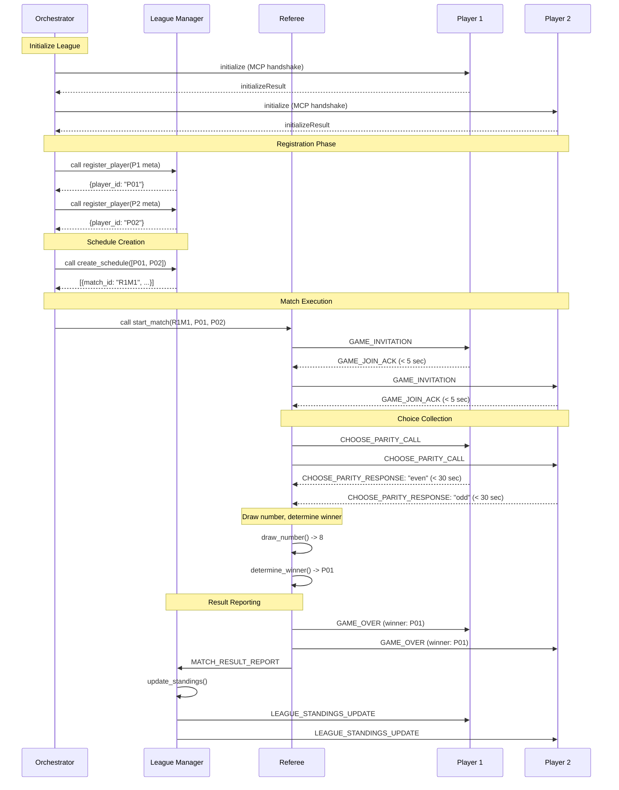
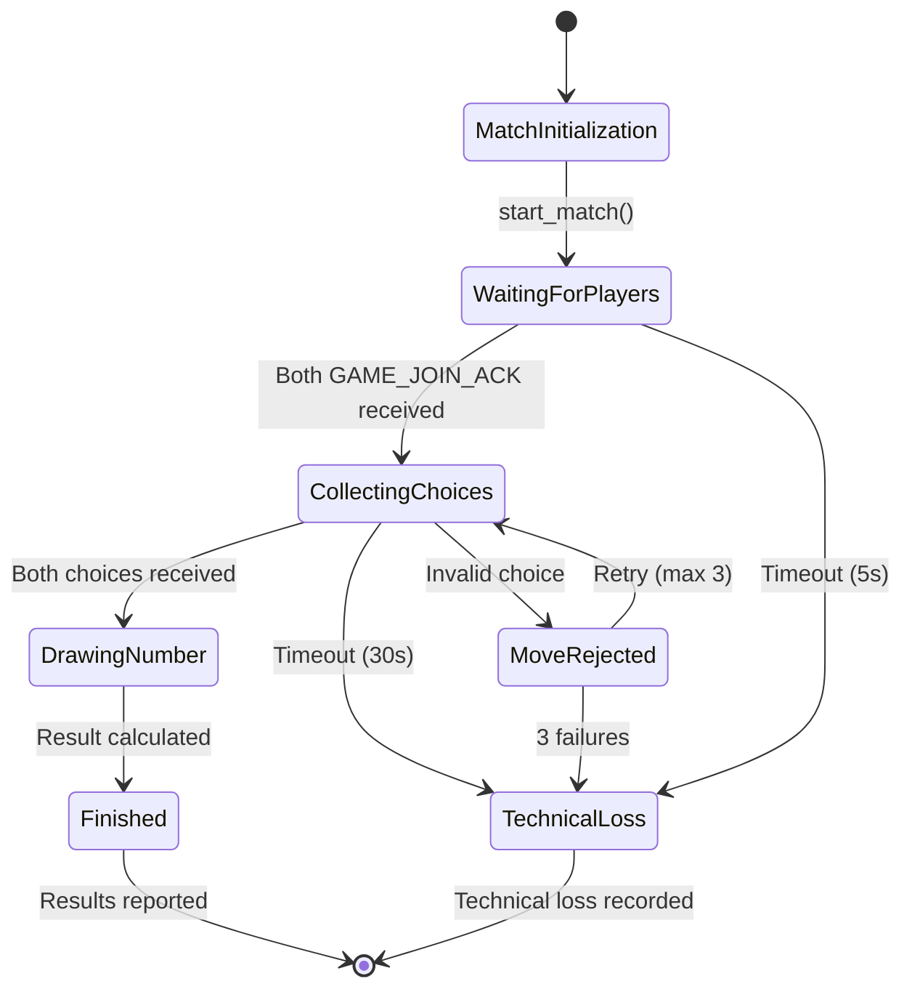

# Product Design Review (PDR)
## Even/Odd AI Agent League System

**Version:** 2.0 (League Protocol V2 Compliant)  
**Date:** December 2025  
**LLM for Development:** Gemini API  
**Protocol:** League Protocol V2 + MCP v2024-11-05  
**Transport:** HTTP + JSON-RPC 2.0

---

## Table of Contents

1. [Executive Summary](#1-executive-summary)
2. [System Architecture](#2-system-architecture)
3. [Component Specifications](#3-component-specifications)
4. [Message Protocol Specifications](#4-message-protocol-specifications)
5. [Data Flow and Sequence Diagrams](#5-data-flow-and-sequence-diagrams)
6. [State Management](#6-state-management)
7. [Testing Strategy](#7-testing-strategy)
8. [Deployment Scenarios](#8-deployment-scenarios)
9. [Error Handling and Edge Cases](#9-error-handling-and-edge-cases)
10. [Performance and Scalability](#10-performance-and-scalability)
11. [References](#11-references)

---

## 1. Executive Summary

### 1.1 Project Overview

The Even/Odd AI Agent League is a distributed multi-agent system that implements a competitive game league using the Model Context Protocol (MCP). The project serves as both a functional game system and a pedagogical tool for understanding AI agent architecture and the MCP protocol.

### 1.2 Key Objectives

1. **League Protocol V2 Compliance**: 100% adherence to League Protocol V2 specification
2. **Referee Registration**: Referees must register with league manager before judging matches
3. **Authentication System**: Token-based authentication for all agents post-registration
4. **UTC Timestamp Enforcement**: All timestamps validated to UTC timezone
5. **Query System**: Players can query league information (LEAGUE_QUERY feature)
6. **Agent-Based Architecture**: Three-layer separation (League, Referee, Game Rules)
7. **Distributed Communication**: HTTP-based transport enabling local and remote deployment
8. **Educational Platform**: Demonstrate AI agent principles and Protocol V2

### 1.3 Core Principles

- **Protocol V2 Compliance**: Full adherence to League Protocol V2 specification
- **Separation of Concerns**: Clear delineation between league management, game refereeing, and specific game logic
- **Protocol-First Design**: Universal JSON-RPC interface enabling language-agnostic implementations
- **Authentication**: Token-based security for all post-registration communications
- **UTC Timestamps**: All timestamps in UTC timezone (ISO-8601 with Z suffix)
- **Stateless Communication**: Referee as single source of truth for game state
- **Intelligent Retry**: 3 retries with 2-second delays for timeout/connection errors only
- **Scalability**: Architecture supports expansion from 4 to thousands of players

### 1.4 Protocol V2 Features Summary

This implementation achieves **100% compliance** with League Protocol V2 specification:

1. **Referee Registration** - Referees register before judging matches
   - `REFEREE_REGISTER_REQUEST` / `REFEREE_REGISTER_RESPONSE` messages
   - Referee receives `referee_id` and `auth_token`

2. **Authentication System** - Token-based security
   - Auth tokens generated during registration for all agents
   - Required in all post-registration messages
   - Validation errors: E011 (missing), E012 (invalid)

3. **UTC Timestamp Enforcement**
   - All timestamps MUST be UTC (ISO-8601 with 'Z' or '+00:00' suffix)
   - Validation error E021 for non-UTC timestamps
   - Automatic enforcement via Pydantic schemas

4. **Protocol Version Validation**
   - Players must declare `protocol_version` in registration
   - League Manager validates minimum version 2.0.0
   - Version mismatch error: E018

5. **LEAGUE_QUERY System** - Information retrieval
   - `GET_STANDINGS` - Current league standings with display names
   - `GET_SCHEDULE` - Full match schedule with completion status
   - `GET_NEXT_MATCH` - Find next match for specific player
   - `GET_PLAYER_STATS` - Detailed player statistics

6. **Intelligent Retry Policy**
   - Timeout errors (E001): Retry up to 3 times with 2-second delays
   - Connection errors (E009): Retry up to 3 times with 2-second delays
   - Other errors: Immediate failure (no retry)

7. **Message Envelope V2**
   - Sender format: `"league_manager"`, `"player:P01"`, `"referee:REF01"`
   - All 18 message types from specification implemented
   - Complete error code catalog

---

## 2. System Architecture

### 2.1 Three-Layer Architecture

```
┌────────────────────────────────────────────────────────────────┐
│                    Layer 1: League Management                  │
│                                                                │
│  Responsibilities:                                             │
│  - Player registration and tracking                            │
│  - Round-Robin schedule generation                            │
│  - Standings calculation and ranking                           │
│  - League-wide announcements                                   │
└────────────────────────────────────────────────────────────────┘
                              │
                              ▼
┌────────────────────────────────────────────────────────────────┐
│                    Layer 2: Game Refereeing                    │
│                                                                │
│  Responsibilities:                                             │
│  - Match initialization and player invitations                 │
│  - Move collection and validation                             │
│  - Winner determination                                        │
│  - Result reporting to League Manager                          │
└────────────────────────────────────────────────────────────────┘
                              │
                              ▼
┌────────────────────────────────────────────────────────────────┐
│                    Layer 3: Game Rules (Pluggable)             │
│                                                                │
│  Responsibilities:                                             │
│  - Game-specific state initialization                          │
│  - Move validation logic                                       │
│  - Winner/draw determination                                   │
│  - Game-specific transitions                                   │
└────────────────────────────────────────────────────────────────┘
```

### 2.2 Component Topology

```
     ┌────────────────┐  ┌────────────┐  ┌───────────────┐
     │ League Manager │  │  Referee   │  │ Player Agents │
     │  MCP Server    │  │ MCP Server │  │  MCP Servers  │
     │   Port: 8000   │  │ Port: 8001 │  │ Ports: 8101-4 │
     │                │  │            │  │               │
     │ Orchestrates:  │  │Orchestrates│  │               │
     │ - Registration │  │- Match     │  │               │
     │ - Schedule     │  │  execution │  │               │
     │ - Standings    │  │- Invitations│ │               │
     └────────┬───────┘  └─────┬──────┘  └───────┬───────┘
              │                │                  │
              └────────────────┴──────────────────┘
                      All communicate via
                   HTTP POST to /mcp endpoint
                    JSON-RPC 2.0 messages
```

**Architecture Notes:**
- **No separate Orchestrator component**: Orchestration is integrated into League Manager and Referee
- **League Manager**: Acts as league-level orchestrator (registration, scheduling, standings)
- **Referee**: Acts as match-level orchestrator (game invitations, choice collection, results)
- **Players**: Self-register by calling League Manager's `register_player` tool

### 2.3 MCP Server/Client Relationships (Protocol V2)

| Component | Primary Role | Also Acts As | Port | Key Tools Exposed |
|-----------|-------------|--------------|------|-------------------|
| League Manager | MCP Server (League Orchestrator) | MCP Client (to notify players/referees) | 8000 | `register_referee`, `register_player`, `report_match_result`, `get_standings`, `handle_league_query` |
| Referee | MCP Server (Match Orchestrator) | MCP Client (to call players) | 8001 | `start_match`, `notify_league_completed` |
| Player Agent | MCP Server | - | 8101-8104 | `handle_game_invitation`, `choose_parity`, `notify_match_result`, `notify_standings` |

**Protocol V2 Notes**: 
- **Referees** must register with League Manager before judging matches
- **Players** self-register by calling League Manager's `register_player` tool
- **Authentication tokens** issued during registration, required for all subsequent messages
- **League Query** system allows players to request standings, schedule, stats, and next match info

### 2.4 Technology Stack

- **Transport Layer**: HTTP/HTTPS
- **Message Protocol**: JSON-RPC 2.0
- **MCP Version**: 2024-11-05
- **Primary Language** (Reference Implementation): Python 3.8+
- **Web Framework**: FastAPI (async support)
- **HTTP Client**: httpx (async support)
- **LLM Integration**: Gemini API (optional for strategy)

---

## 3. Component Specifications

### 3.1 League Manager Specification

#### 3.1.1 Purpose
Manages the entire league lifecycle from referee/player registration through final standings calculation. Acts as the league-level orchestrator.

**Protocol V2 Registration Process:**
1. **Referee Registration** (NEW in V2):
   - Referees call `register_referee` tool before judging matches
   - League Manager generates `referee_id` and `auth_token`
   - Referee stores token for use in all subsequent messages

2. **Player Registration**:
   - Players self-register by calling the `register_player` tool
   - Players must include `protocol_version` (e.g., "2.1.0") in metadata
   - League Manager validates protocol version (≥2.0.0)
   - League Manager generates `player_id` and `auth_token`
   - League Manager waits for a configurable registration period (default: 60 seconds)
   - After registration period ends, League Manager proceeds to schedule creation
   - Players connecting after registration period are rejected

3. **Query System** (NEW in V2):
   - Players/referees can query league information using `handle_league_query`
   - Supports GET_STANDINGS, GET_SCHEDULE, GET_NEXT_MATCH, GET_PLAYER_STATS

#### 3.1.2 State

```python
class LeagueState:
    league_id: str               # Unique league identifier
    game_type: str               # "even_odd"
    referees: Dict[str, RefereeMeta]  # referee_id -> metadata (NEW in V2)
    referee_tokens: Dict[str, str]    # referee_id -> auth_token (NEW in V2)
    players: Dict[str, PlayerMeta]    # player_id -> metadata
    player_tokens: Dict[str, str]     # player_id -> auth_token (NEW in V2)
    schedule: List[Match]        # All matches
    results: Dict[str, MatchResult]  # match_id -> result
    standings: List[StandingsEntry]  # Ordered by rank
    registration_timeout: int    # Seconds to wait for registration (default: 60)
    registration_closed: bool    # True after timeout expires
```

#### 3.1.3 Exposed MCP Tools

**Tool 1: register_player**
```json
{
  "name": "register_player",
  "description": "Register a new player to the league",
  "inputSchema": {
    "type": "object",
    "properties": {
      "player_meta": {
        "type": "object",
        "properties": {
          "display_name": {"type": "string"},
          "version": {"type": "string"},
          "game_types": {
            "type": "array", 
            "items": {"type": "string"}
          },
          "contact_endpoint": {"type": "string"}
        },
        "required": ["display_name", "game_types", "contact_endpoint"]
      }
    },
    "required": ["player_meta"]
  }
}
```

**Output Schema:**
```json
{
  "type": "object",
  "properties": {
    "status": {"type": "string", "enum": ["ACCEPTED", "REJECTED"]},
    "player_id": {"type": "string"},
    "reason": {"type": "string"}
  },
  "required": ["status"]
}
```

**Rejection Scenarios:**
- `reason: "Registration closed"` - Player attempted to register after registration timeout expired
- `reason: "Game type not supported"` - Player's game_types don't include "even_odd"

**Tool 2: create_schedule**
```json
{
  "name": "create_schedule",
  "description": "Generate Round-Robin schedule for all registered players",
  "inputSchema": {
    "type": "object",
    "properties": {
      "players": {
        "type": "array",
        "items": {"type": "string"}
      }
    },
    "required": ["players"]
  }
}
```

**Output Schema:**
```json
{
  "type": "array",
  "items": {
    "type": "object",
    "properties": {
      "match_id": {"type": "string"},
      "round_id": {"type": "integer"},
      "player_A_id": {"type": "string"},
      "player_B_id": {"type": "string"},
      "game_type": {"type": "string"}
    }
  }
}
```

**Tool 3: report_match_result**
```json
{
  "name": "report_match_result",
  "description": "Record match outcome from referee",
  "inputSchema": {
    "type": "object",
    "properties": {
      "match_id": {"type": "string"},
      "winner": {"type": "string"},
      "score": {
        "type": "object",
        "additionalProperties": {"type": "integer"}
      },
      "details": {"type": "object"}
    },
    "required": ["match_id", "score"]
  }
}
```

**Tool 4: get_standings**
```json
{
  "name": "get_standings",
  "description": "Retrieve current league standings",
  "inputSchema": {
    "type": "object",
    "properties": {
      "league_id": {"type": "string"}
    }
  }
}
```

**Output Schema:**
```json
{
  "type": "array",
  "items": {
    "type": "object",
    "properties": {
      "rank": {"type": "integer"},
      "player_id": {"type": "string"},
      "display_name": {"type": "string"},
      "played": {"type": "integer"},
      "wins": {"type": "integer"},
      "draws": {"type": "integer"},
      "losses": {"type": "integer"},
      "points": {"type": "integer"}
    }
  }
}
```

### 3.2 Referee Specification

#### 3.2.1 Purpose
Manages individual match execution, enforcing game rules and timing constraints.

#### 3.2.2 State

```python
class MatchState:
    match_id: str
    game_type: str
    player_A_id: str
    player_B_id: str
    player_A_choice: Optional[str]  # "even" or "odd"
    player_B_choice: Optional[str]
    drawn_number: Optional[int]     # 1-10
    winner: Optional[str]
    status: MatchStatus             # WAITING/COLLECTING/DRAWING/FINISHED
    timestamps: Dict[str, datetime]
```

#### 3.2.3 Exposed MCP Tools

**Tool 1: start_match**
```json
{
  "name": "start_match",
  "description": "Initialize a new match between two players",
  "inputSchema": {
    "type": "object",
    "properties": {
      "match_id": {"type": "string"},
      "player_A_id": {"type": "string"},
      "player_B_id": {"type": "string"},
      "player_A_endpoint": {"type": "string"},
      "player_B_endpoint": {"type": "string"}
    },
    "required": ["match_id", "player_A_id", "player_B_id", 
                 "player_A_endpoint", "player_B_endpoint"]
  }
}
```

**Tool 2: collect_choices**
```json
{
  "name": "collect_choices",
  "description": "Request and collect parity choices from both players",
  "inputSchema": {
    "type": "object",
    "properties": {
      "game_session_id": {"type": "string"}
    },
    "required": ["game_session_id"]
  }
}
```

**Tool 3: draw_number**
```json
{
  "name": "draw_number",
  "description": "Draw random number and determine winner",
  "inputSchema": {
    "type": "object",
    "properties": {
      "game_session_id": {"type": "string"}
    }
  }
}
```

**Tool 4: finalize_match**
```json
{
  "name": "finalize_match",
  "description": "Report result to League Manager and notify players",
  "inputSchema": {
    "type": "object",
    "properties": {
      "game_session_id": {"type": "string"}
    }
  }
}
```

### 3.3 Player Agent Specification

#### 3.3.1 Purpose
Represents individual player in the league, responding to invitations and making game decisions.

#### 3.3.2 State

```python
class PlayerAgentState:
    player_id: str
    display_name: str
    history: List[MatchResult]
    statistics: Dict[str, Any]
    strategy_config: Dict[str, Any]
```

#### 3.3.3 Exposed MCP Tools

**Tool 1: handle_game_invitation**

**Input Schema (exact as per requirements):**
```json
{
  "name": "handle_game_invitation",
  "description": "Receive and respond to game invitation from referee",
  "inputSchema": {
    "type": "object",
    "properties": {
      "message_type": {"type": "string", "const": "GAME_INVITATION"},
      "league_id": {"type": "string"},
      "round_id": {"type": "integer"},
      "match_id": {"type": "string"},
      "game_type": {"type": "string"},
      "role_in_match": {"type": "string", "enum": ["PLAYER_A", "PLAYER_B"]},
      "opponent_id": {"type": "string"},
      "conversation_id": {"type": "string"}
    },
    "required": ["message_type", "match_id", "game_type", "opponent_id"]
  }
}
```

**Output Schema (GAME_JOIN_ACK):**
```json
{
  "type": "object",
  "properties": {
    "message_type": {"type": "string", "const": "GAME_JOIN_ACK"},
    "match_id": {"type": "string"},
    "player_id": {"type": "string"},
    "arrival_timestamp": {"type": "string", "format": "date-time"},
    "accept": {"type": "boolean"}
  },
  "required": ["message_type", "match_id", "player_id", "arrival_timestamp", "accept"]
}
```

**Timing Constraint:** Must respond within 5 seconds.

**Tool 2: choose_parity**

**Input Schema (exact as per requirements):**
```json
{
  "name": "choose_parity",
  "description": "Choose even or odd for the current match",
  "inputSchema": {
    "type": "object",
    "properties": {
      "message_type": {"type": "string", "const": "CHOOSE_PARITY_CALL"},
      "match_id": {"type": "string"},
      "player_id": {"type": "string"},
      "game_type": {"type": "string"},
      "context": {
        "type": "object",
        "properties": {
          "opponent_id": {"type": "string"},
          "round_id": {"type": "integer"},
          "your_standings": {
            "type": "object",
            "properties": {
              "wins": {"type": "integer"},
              "losses": {"type": "integer"},
              "draws": {"type": "integer"}
            }
          }
        }
      },
      "deadline": {"type": "string", "format": "date-time"}
    },
    "required": ["message_type", "match_id", "player_id", "game_type"]
  }
}
```

**Output Schema (CHOOSE_PARITY_RESPONSE):**
```json
{
  "type": "object",
  "properties": {
    "message_type": {"type": "string", "const": "CHOOSE_PARITY_RESPONSE"},
    "match_id": {"type": "string"},
    "player_id": {"type": "string"},
    "parity_choice": {
      "type": "string",
      "enum": ["even", "odd"]
    }
  },
  "required": ["message_type", "match_id", "player_id", "parity_choice"]
}
```

**Timing Constraint:** Must respond within 30 seconds.
**Critical Validation:** `parity_choice` MUST be exactly "even" or "odd" (lowercase).

**Tool 3: notify_match_result**

**Input Schema (GAME_OVER message):**
```json
{
  "name": "notify_match_result",
  "description": "Receive notification of match outcome",
  "inputSchema": {
    "type": "object",
    "properties": {
      "message_type": {"type": "string", "const": "GAME_OVER"},
      "match_id": {"type": "string"},
      "game_type": {"type": "string"},
      "game_result": {
        "type": "object",
        "properties": {
          "status": {"type": "string", "enum": ["WIN", "DRAW", "TECHNICAL_LOSS"]},
          "winner_player_id": {"type": "string"},
          "drawn_number": {"type": "integer", "minimum": 1, "maximum": 10},
          "number_parity": {"type": "string", "enum": ["even", "odd"]},
          "choices": {
            "type": "object",
            "additionalProperties": {"type": "string"}
          },
          "reason": {"type": "string"}
        },
        "required": ["status", "drawn_number", "number_parity", "choices"]
      }
    },
    "required": ["message_type", "match_id", "game_result"]
  }
}
```

**Output:** Simple acknowledgment (ACK).

#### 3.3.4 Strategy Implementations

**Strategy 1: Random**
```python
import random

def choose_parity_random(context: dict) -> str:
    return random.choice(["even", "odd"])
```

**Strategy 2: LLM-Guided (Gemini)**
```python
import google.generativeai as genai

def choose_parity_llm(context: dict, history: list) -> str:
    prompt = f"""You are playing Even/Odd game.
    Opponent: {context['opponent_id']}
    Your stats: {context.get('your_standings', {})}
    History: {history[-5:] if history else 'None'}
    
    Choose 'even' or 'odd'. Reply with only that single word."""
    
    model = genai.GenerativeModel('gemini-pro')
    response = model.generate_content(prompt)
    choice = response.text.strip().lower()
    
    return choice if choice in ["even", "odd"] else "even"
```

---

## 4. Message Protocol Specifications

### 4.1 Common Message Structure (Protocol V2)

All messages in the league protocol MUST include these base fields:

```json
{
  "protocol": "league.v2",
  "message_type": "<MESSAGE_TYPE>",
  "sender": "league_manager | player:P01 | referee:REF01",
  "timestamp": "2025-01-15T10:30:00Z",
  "conversation_id": "uuid-string",
  "auth_token": "tok_..."  // Required after registration
}
```

**Protocol V2 Requirements:**
- **protocol**: Must be "league.v2"
- **sender**: Format is "league_manager", "player:<ID>", or "referee:<ID>"
- **timestamp**: MUST be UTC (ISO-8601 ending with 'Z' or '+00:00')
- **auth_token**: Required for all messages after registration (E012 error if invalid/missing)

**Additional Required Fields:**

**For Game Messages** (in addition to base fields):
- `match_id` - MUST be included in all game-related messages
- `round_id` - MUST be included in all game-related messages

**For Player-Directed Messages** (in addition to base fields):
- `player_id` - MUST be included when message is directed to/from a specific player

**Example Complete Message:**
```json
{
  "protocol": "league.v1",
  "message_type": "CHOOSE_PARITY_CALL",
  "league_id": "league_2025_even_odd",
  "round_id": 1,
  "match_id": "R1M1",
  "conversation_id": "conv-r1m1-001",
  "sender": "referee",
  "timestamp": "2025-01-15T10:30:00Z",
  "player_id": "P01",
  "game_type": "even_odd",
  "context": { ... },
  "deadline": "2025-01-15T10:30:30Z"
}
```

### 4.2 Complete Message Catalog

#### 4.2.1 League Registration Messages

**LEAGUE_REGISTER_REQUEST (Protocol V2)**
```json
{
  "protocol": "league.v2",
  "message_type": "LEAGUE_REGISTER_REQUEST",
  "sender": "player:unknown",
  "timestamp": "2025-01-15T10:29:00Z",
  "conversation_id": "conv-reg-001",
  "league_id": "league_2025_even_odd",
  "player_meta": {
    "display_name": "Agent Alpha",
    "version": "1.0.0",
    "protocol_version": "2.1.0",
    "game_types": ["even_odd"],
    "contact_endpoint": "http://localhost:8101/mcp"
  }
}
```

**LEAGUE_REGISTER_RESPONSE (Protocol V2)**
```json
{
  "protocol": "league.v2",
  "message_type": "LEAGUE_REGISTER_RESPONSE",
  "sender": "league_manager",
  "timestamp": "2025-01-15T10:29:01Z",
  "conversation_id": "conv-reg-001",
  "league_id": "league_2025_even_odd",
  "player_id": "P01",
  "auth_token": "tok_P01_abc123def456",
  "status": "ACCEPTED",
  "reason": null
}
```

**NEW in V2: REFEREE_REGISTER_REQUEST/RESPONSE**
```json
{
  "protocol": "league.v2",
  "message_type": "REFEREE_REGISTER_REQUEST",
  "sender": "referee:unknown",
  "timestamp": "2025-01-15T10:28:00Z",
  "conversation_id": "conv-ref-reg-001",
  "referee_meta": {
    "display_name": "Referee-8001",
    "version": "1.0.0",
    "game_types": ["even_odd"],
    "contact_endpoint": "http://localhost:8001/mcp",
    "max_concurrent_matches": 2
  }
}

// Response
{
  "protocol": "league.v2",
  "message_type": "REFEREE_REGISTER_RESPONSE",
  "sender": "league_manager",
  "timestamp": "2025-01-15T10:28:01Z",
  "conversation_id": "conv-ref-reg-001",
  "referee_id": "REF01",
  "auth_token": "tok_REF01_xyz789",
  "status": "ACCEPTED"
}
```

#### 4.2.2 Round Management Messages

**ROUND_ANNOUNCEMENT**
```json
{
  "protocol": "league.v1",
  "message_type": "ROUND_ANNOUNCEMENT",
  "league_id": "league_2025_even_odd",
  "round_id": 1,
  "conversation_id": "conv-round-1",
  "sender": "league_manager",
  "timestamp": "2025-01-15T10:30:00Z",
  "matches": [
    {
      "match_id": "R1M1",
      "game_type": "even_odd",
      "player_A_id": "P01",
      "player_B_id": "P02",
      "referee_endpoint": "http://localhost:8001/mcp"
    }
  ]
}
```

#### 4.2.3 Game Flow Messages

**GAME_INVITATION** (Referee → Player)
```json
{
  "protocol": "league.v1",
  "message_type": "GAME_INVITATION",
  "league_id": "league_2025_even_odd",
  "round_id": 1,
  "match_id": "R1M1",
  "conversation_id": "conv-r1m1-001",
  "sender": "referee",
  "timestamp": "2025-01-15T10:30:00Z",
  "player_id": "P01",
  "game_type": "even_odd",
  "role_in_match": "PLAYER_A",
  "opponent_id": "P02"
}
```

**GAME_JOIN_ACK** (Player → Referee)
```json
{
  "protocol": "league.v1",
  "message_type": "GAME_JOIN_ACK",
  "league_id": "league_2025_even_odd",
  "round_id": 1,
  "match_id": "R1M1",
  "conversation_id": "conv-r1m1-001",
  "sender": "player:P01",
  "timestamp": "2025-01-15T10:30:00Z",
  "player_id": "P01",
  "arrival_timestamp": "2025-01-15T10:30:00Z",
  "accept": true
}
```

**CHOOSE_PARITY_CALL** (Referee → Player)
```json
{
  "protocol": "league.v1",
  "message_type": "CHOOSE_PARITY_CALL",
  "league_id": "league_2025_even_odd",
  "round_id": 1,
  "match_id": "R1M1",
  "conversation_id": "conv-r1m1-001",
  "sender": "referee",
  "timestamp": "2025-01-15T10:30:00Z",
  "player_id": "P01",
  "game_type": "even_odd",
  "context": {
    "opponent_id": "P02",
    "round_id": 1,
    "your_standings": {
      "wins": 2,
      "losses": 1,
      "draws": 0
    }
  },
  "deadline": "2025-01-15T10:30:30Z"
}
```

**CHOOSE_PARITY_RESPONSE** (Player → Referee)
```json
{
  "protocol": "league.v1",
  "message_type": "CHOOSE_PARITY_RESPONSE",
  "league_id": "league_2025_even_odd",
  "round_id": 1,
  "match_id": "R1M1",
  "conversation_id": "conv-r1m1-001",
  "sender": "player:P01",
  "timestamp": "2025-01-15T10:30:05Z",
  "player_id": "P01",
  "parity_choice": "even"
}
```

**GAME_OVER** (Referee → Players)
```json
{
  "protocol": "league.v1",
  "message_type": "GAME_OVER",
  "league_id": "league_2025_even_odd",
  "round_id": 1,
  "match_id": "R1M1",
  "conversation_id": "conv-r1m1-001",
  "sender": "referee",
  "timestamp": "2025-01-15T10:30:35Z",
  "game_type": "even_odd",
  "game_result": {
    "status": "WIN",
    "winner_player_id": "P01",
    "drawn_number": 8,
    "number_parity": "even",
    "choices": {
      "P01": "even",
      "P02": "odd"
    },
    "reason": "P01 chose even, number was 8 (even)"
  }
}
```

**MATCH_RESULT_REPORT** (Referee → League Manager)
```json
{
  "protocol": "league.v1",
  "message_type": "MATCH_RESULT_REPORT",
  "league_id": "league_2025_even_odd",
  "round_id": 1,
  "match_id": "R1M1",
  "conversation_id": "conv-r1m1-report",
  "sender": "referee",
  "timestamp": "2025-01-15T10:30:36Z",
  "game_type": "even_odd",
  "result": {
    "winner": "P01",
    "score": {
      "P01": 3,
      "P02": 0
    },
    "details": {
      "drawn_number": 8,
      "choices": {
        "P01": "even",
        "P02": "odd"
      }
    }
  }
}
```

#### 4.2.4 Standings Update Message

**LEAGUE_STANDINGS_UPDATE** (League Manager → All Players)
```json
{
  "protocol": "league.v1",
  "message_type": "LEAGUE_STANDINGS_UPDATE",
  "league_id": "league_2025_even_odd",
  "round_id": 1,
  "conversation_id": "conv-standings-r1",
  "sender": "league_manager",
  "timestamp": "2025-01-15T10:31:00Z",
  "standings": [
    {
      "rank": 1,
      "player_id": "P01",
      "display_name": "Agent Alpha",
      "played": 2,
      "wins": 2,
      "draws": 0,
      "losses": 0,
      "points": 6
    }
  ]
}
```

### 4.3 MCP JSON-RPC Wrapper

All messages are wrapped in JSON-RPC 2.0 when sent via MCP:

**Request:**
```json
{
  "jsonrpc": "2.0",
  "method": "tools/call",
  "params": {
    "name": "choose_parity",
    "arguments": {
      "message_type": "CHOOSE_PARITY_CALL",
      "match_id": "R1M1",
      "player_id": "P01",
      "game_type": "even_odd",
      "context": {...}
    }
  },
  "id": 1
}
```

**Response:**
```json
{
  "jsonrpc": "2.0",
  "result": {
    "content": [
      {
        "type": "text",
        "text": "{\"message_type\": \"CHOOSE_PARITY_RESPONSE\", ...}"
      }
    ]
  },
  "id": 1
}
```

---

## 5. Data Flow and Sequence Diagrams

### 5.1 Complete League Execution Flow



### 5.2 Single Match Flow (Detailed)



### 5.3 Game Rules Module Flow (Even/Odd)

```python
# Pseudocode for winner determination
def determine_winner(choice_A: str, choice_B: str) -> str:
    number = random.randint(1, 10)
    parity = "even" if number % 2 == 0 else "odd"
    
    A_correct = (choice_A == parity)
    B_correct = (choice_B == parity)
    
    if choice_A == choice_B:
        # Both chose same: always DRAW
        return "DRAW"
    elif A_correct:
        return "PLAYER_A"
    elif B_correct:
        return "PLAYER_B"
    else:
        # Should not happen if choices are different
        return "DRAW"
```

**Important Logic Note:** If both players choose the same option (both "even" or both "odd"), the result is ALWAYS a draw, regardless of whether the drawn number matches their choice or not.

---

## 6. State Management

### 6.1 Component State Machines

#### 6.1.1 League Manager States

```
States: [INITIALIZING, REGISTERING, READY, RUNNING, COMPLETED]

Transitions:
  INITIALIZING --[initialize]--> REGISTERING
  REGISTERING --[all_registered]--> READY
  READY --[start_league]--> RUNNING
  RUNNING --[all_matches_complete]--> COMPLETED
```

#### 6.1.2 Referee States (Per Match)

```
States: [IDLE, WAITING_FOR_PLAYERS, COLLECTING_CHOICES, DRAWING_NUMBER, FINISHED]

Transitions:
  IDLE --[start_match]--> WAITING_FOR_PLAYERS
  WAITING_FOR_PLAYERS --[both_joined]--> COLLECTING_CHOICES
  WAITING_FOR_PLAYERS --[timeout]--> FINISHED (technical loss)
  COLLECTING_CHOICES --[both_responded]--> DRAWING_NUMBER
  COLLECTING_CHOICES --[timeout]--> FINISHED (technical loss)
  COLLECTING_CHOICES --[invalid_move]--> COLLECTING_CHOICES (max 3 retries)
  DRAWING_NUMBER --[auto]--> FINISHED
  FINISHED --[reported]--> IDLE
```

#### 6.1.3 Player Agent States

```
States: [IDLE, INVITED, PLAYING, AWAITING_RESULT]

Transitions:
  IDLE --[GAME_INVITATION]--> INVITED
  INVITED --[GAME_JOIN_ACK sent]--> PLAYING
  PLAYING --[CHOOSE_PARITY_RESPONSE sent]--> AWAITING_RESULT
  AWAITING_RESULT --[GAME_OVER received]--> IDLE
```

### 6.2 Data Persistence Requirements

#### 6.2.1 League Manager Persistence

**Must Persist:**
- Player registry (player_id, metadata, endpoints)
- Complete match schedule
- All match results
- Current standings

**Storage Format:** JSON file or SQLite database

**Example Schema:**
```python
{
  "league_id": "league_2025_even_odd",
  "players": {
    "P01": {
      "display_name": "Agent Alpha",
      "endpoint": "http://localhost:8101/mcp",
      "registered_at": "2025-01-15T10:00:00Z"
    }
  },
  "matches": [...],
  "results": {...},
  "standings": [...]
}
```

#### 6.2.2 Player Agent Persistence

**Optional Persistence:**
- Match history for strategy learning
- Opponent profiles
- Performance statistics

**Recommended:** In-memory for simple strategies, persistent storage for learning agents.

---

## 7. Testing Strategy

### 7.1 Local Testing Environment

#### 7.1.1 Setup Requirements

```bash
# Directory structure
even_odd_league/
├── league_manager.py
├── referee.py
├── player_agent.py
├── orchestrator.py
├── game_rules/
│   └── even_odd.py
├── tests/
│   ├── test_protocol.py
│   ├── test_integration.py
│   └── dummy_agents/
│       ├── always_even.py
│       ├── always_odd.py
│       └── random_agent.py
├── requirements.txt
└── README.md
```

#### 7.1.2 Running Local League

**Terminal 1: League Manager**
```bash
cd /path/to/project
python league_manager.py --port 8000 --league-id league_test_001
```

**Terminal 2: Referee**
```bash
python referee.py --port 8001
```

**Terminal 3-6: Player Agents**
```bash
python player_agent.py --port 8101 --player-id P01 --strategy random
python player_agent.py --port 8102 --player-id P02 --strategy random
python player_agent.py --port 8103 --player-id P03 --strategy always_even
python player_agent.py --port 8104 --player-id P04 --strategy always_odd
```

**Terminal 7: Orchestrator**
```bash
python orchestrator.py --config config.json
```

**config.json:**
```json
{
  "league_manager": "http://localhost:8000/mcp",
  "referee": "http://localhost:8001/mcp",
  "players": [
    {"id": "P01", "endpoint": "http://localhost:8101/mcp"},
    {"id": "P02", "endpoint": "http://localhost:8102/mcp"},
    {"id": "P03", "endpoint": "http://localhost:8103/mcp"},
    {"id": "P04", "endpoint": "http://localhost:8104/mcp"}
  ]
}
```

### 7.2 Testing Checklist

#### 7.2.1 Unit Tests

- [ ] League Manager: register_player validation
- [ ] League Manager: schedule generation (Round-Robin correctness)
- [ ] League Manager: standings calculation
- [ ] Referee: winner determination logic
- [ ] Referee: timeout handling
- [ ] Player: GAME_JOIN_ACK response format
- [ ] Player: CHOOSE_PARITY_RESPONSE validation (only "even"/"odd")

#### 7.2.2 Integration Tests

- [ ] Full MCP handshake (initialize/initialized)
- [ ] Complete match execution (invitation → result)
- [ ] Multiple concurrent matches
- [ ] Timing compliance (5s, 30s)
- [ ] Error recovery (invalid JSON, timeout, disconnection)

#### 7.2.3 Protocol Compliance Tests

**Critical Validations:**
```python
def test_parity_choice_validation():
    """parity_choice must be exactly 'even' or 'odd'"""
    valid = ["even", "odd"]
    invalid = ["EVEN", "Even", "ODD", "Odd", "0", "1", "e", "o"]
    
    for choice in valid:
        assert validate_parity_choice(choice) == True
    
    for choice in invalid:
        assert validate_parity_choice(choice) == False

def test_timestamp_format():
    """All timestamps must be ISO-8601 with Z suffix"""
    valid = "2025-01-15T10:30:00Z"
    invalid = ["2025-01-15 10:30:00", "2025-01-15T10:30:00"]
    
    assert validate_timestamp(valid) == True
    for ts in invalid:
        assert validate_timestamp(ts) == False
```

### 7.3 Test Agents

#### 7.3.1 Deterministic Test Agents

**always_even.py**
```python
def choose_parity(context):
    return "even"
```

**always_odd.py**
```python
def choose_parity(context):
    return "odd"
```

**Usage:** Test that protocol works with predictable outcomes.

#### 7.3.2 Stress Test Agents

**slow_agent.py**
```python
import time

def choose_parity(context):
    time.sleep(25)  # Near timeout limit
    return "even"
```

**Usage:** Verify timeout handling doesn't fail prematurely.

**failing_agent.py**
```python
def choose_parity(context):
    return "INVALID"  # Should trigger retry logic
```

---

## 8. Deployment Scenarios

### 8.1 Scenario 1: Local Development (Single Machine)

**Topology:**
```
localhost (127.0.0.1)
├── League Manager  :8000
├── Referee         :8001
├── Player 1        :8101
├── Player 2        :8102
├── Player 3        :8103
└── Player 4        :8104
```

**Communication:** All via `http://localhost:<port>/mcp`

**Advantages:**
- Simple setup
- No network configuration
- Fast iteration

**Use Case:** Development, testing, homework submission (Stage 1)

### 8.2 Scenario 2: Multi-Machine (Local Network)

**Topology:**
```
Machine A (192.168.1.10)
├── League Manager  :8000
└── Referee         :8001

Machine B (192.168.1.11)
├── Player 1        :8101
└── Player 2        :8102

Machine C (192.168.1.12)
├── Player 3        :8101
└── Player 4        :8102
```

**Configuration:**
```json
{
  "league_manager": "http://192.168.1.10:8000/mcp",
  "referee": "http://192.168.1.10:8001/mcp",
  "players": [
    {"id": "P01", "endpoint": "http://192.168.1.11:8101/mcp"},
    {"id": "P02", "endpoint": "http://192.168.1.11:8102/mcp"},
    {"id": "P03", "endpoint": "http://192.168.1.12:8101/mcp"},
    {"id": "P04", "endpoint": "http://192.168.1.12:8102/mcp"}
  ]
}
```

**Networking Requirements:**
- Firewall rules: Allow inbound on ports 8000-8001, 8101-8104
- Network reachability testing: `curl http://192.168.1.11:8101/mcp`

**Use Case:** Distributed testing, class league

### 8.3 Scenario 3: Cloud Deployment

**Architecture:**
```
Load Balancer (HTTPS)
│
├── Central Services (Kubernetes Pod)
│   ├── League Manager Container
│   └── Referee Container(s) - autoscaling
│
└── Player Agents (Student Submissions)
    ├── Sandboxed Container 1
    ├── Sandboxed Container 2
    └── ... (up to 30 containers)
```

**Security Considerations:**
- TLS encryption (HTTPS)
- Authentication tokens in MCP headers
- Rate limiting per agent
- Resource quotas (CPU/memory)
- Network isolation between players

**Deployment Steps:**
1. Package each component as Docker container
2. Deploy League Manager + Referee to stable nodes
3. Deploy player agents with resource limits
4. Configure service discovery (Kubernetes DNS)
5. Run orchestrator as CronJob

---

## 9. Error Handling and Edge Cases

### 9.1 Timeout Specifications

**Timeout Values:**
- **GAME_JOIN_ACK**: 5 seconds (from invitation to acknowledgment)
- **CHOOSE_PARITY_RESPONSE**: 30 seconds (from choice request to response)
- **Other responses**: 10 seconds (default for all other operations)

| Scenario | Timeout | Action | Result |
|----------|---------|--------|--------|
| Player not responding to GAME_INVITATION | 5s | Mark as technical loss | Opponent wins |
| Player not responding to CHOOSE_PARITY_CALL | 30s | Mark as technical loss | Opponent wins |
| HTTP request (general) | 10s | Retry once, then fail | Error logged |
| Player unreachable | 10 seconds (HTTP) | Retry once, then fail | Match postponed or forfeit |

**Implementation:**
```python
import httpx

async def call_player_with_timeout(endpoint, method, params, timeout=30):
    try:
        async with httpx.AsyncClient() as client:
            response = await client.post(
                endpoint,
                json={
                    "jsonrpc": "2.0",
                    "method": method,
                    "params": params,
                    "id": 1
                },
                timeout=timeout
            )
            return response.json()
    except httpx.TimeoutException:
        return {"error": "TIMEOUT", "code": -32000}
    except Exception as e:
        return {"error": str(e), "code": -32603}
```

### 9.2 Invalid Input Handling

| Error Type | Example | Response | Recovery |
|------------|---------|----------|----------|
| Invalid parity choice | "EVEN" instead of "even" | MOVE_REJECTED | Retry (max 3) |
| Malformed JSON | Missing required field | JSON-RPC error -32602 | Log and skip |
| Wrong message type | GAME_OVER during choice collection | Ignore | Continue |
| Duplicate player_id | Two players register as "P01" | REJECTED status | Manual resolution |

**Retry Logic:**
```python
MAX_RETRIES = 3

async def collect_choice_with_retry(player_endpoint, match_id):
    for attempt in range(MAX_RETRIES):
        response = await call_player(player_endpoint, "choose_parity", {...})
        
        choice = response.get("parity_choice")
        if choice in ["even", "odd"]:
            return choice
        
        # Invalid choice, notify player
        await call_player(player_endpoint, "notify_error", {
            "error": "MOVE_REJECTED",
            "message": "parity_choice must be 'even' or 'odd'"
        })
    
    # All retries failed
    return None  # Triggers technical loss
```

### 9.3 Network Failures

**Strategy: Graceful Degradation**

1. **Player Disconnection Mid-Match:**
   - Referee waits for timeout
   - Awards technical loss
   - Reports to League Manager
   - Match continues with other matches

2. **Referee Crash:**
   - Orchestrator detects failure (heartbeat)
   - Aborts current matches
   - Restarts referee
   - Replays affected matches

3. **League Manager Crash:**
   - Orchestrator loads from persistent state
   - Restarts League Manager
   - Resends last standings update

---

## 10. Performance and Scalability

### 10.1 Parallel Match Execution

**Architecture:**
- Multiple matches run in parallel using multiple Referee instances
- For 4 players: 2 concurrent Referees (2 matches running simultaneously)
- Designed to scale up to 50 players
- League Manager uses threading/async to handle concurrent standings updates

**Implementation Example (4 players):**
```python
# Round-Robin for 4 players: 6 total matches
# Round 1: Match 1 (P01 vs P02) + Match 2 (P03 vs P04) - parallel
# Round 2: Match 3 (P01 vs P03) + Match 4 (P02 vs P04) - parallel  
# Round 3: Match 5 (P01 vs P04) + Match 6 (P02 vs P03) - parallel

# Each Referee handles one match independently
```

**Referee Scaling:**
- 4 players → 6 matches → 2 concurrent referees
- 10 players → 45 matches → 5 concurrent referees
- 50 players → 1,225 matches → 25 concurrent referees

**Standings Update Protection:**
```python
# In league_manager.py
import threading

standings_lock = threading.Lock()

def update_standings(match_result):
    with standings_lock:
        # Safe concurrent updates
        self.standings = recalculate_standings(match_result)
        self.save_to_disk()
```

**Performance Benefit:**
- 4 players: Sequential = 6 min, Parallel = 3 min
- 50 players: Sequential = ~20 hours, Parallel = ~1 hour

### 10.2 Resource Requirementsce Metrics

| Metric | Target | Measurement Method |
|--------|--------|-------------------|
| Match Duration | < 60 seconds | End-to-end timing |
| API Response Time | < 100ms (p95) | Per-call latency |
| Concurrent Matches | 10+ | Referee load test |
| League Size | Up to 100 players | Stress test |

### 10.2 Bottleneck Analysis

**Bottleneck 1: Sequential Match Execution**
- **Problem:** Running matches one-by-one is slow
- **Solution:** Parallel match execution
  ```python
  import asyncio
  
  async def run_round(matches):
      tasks = [execute_match(m) for m in matches]
      results = await asyncio.gather(*tasks)
      return results
  ```

**Bottleneck 2: Synchronous HTTP Calls**
- **Problem:** Blocking I/O during player calls
- **Solution:** Async HTTP with httpx
  ```python
  async with httpx.AsyncClient() as client:
      responses = await asyncio.gather(
          client.post(player1_endpoint, ...),
          client.post(player2_endpoint, ...)
      )
  ```

### 10.3 Scalability Considerations

**For 4 Players:**
- Total Matches: 6 (Round-Robin)
- Sequential Execution: ~6 minutes
- Parallel Execution: ~2 minutes

**For 100 Players:**
- Total Matches: 4,950
- Sequential: ~82 hours
- Parallel (10 concurrent): ~8 hours
- Parallel (50 concurrent): ~2 hours

**Scaling Strategy:**
- Deploy multiple Referee instances
- Load balance matches across referees
- Use message queue (RabbitMQ) for match distribution

---

## 11. References

1. **Model Context Protocol Specification**  
   Anthropic, 2024  
   https://modelcontextprotocol.io/

2. **JSON-RPC 2.0 Specification**  
   JSON-RPC Working Group, 2010  
   https://www.jsonrpc.org/specification

3. **"AI Agents with MCP" (Book)**  
   Dr. Yoram Segal, 2025  
   Part 1: Foundations and MCP Clients

4. **MCP Large-Scale Protocol Documentation**  
   Dr. Yoram Segal, December 2025  
   Section: "League Architecture" and "Even/Odd Game Implementation"

5. **FastAPI Documentation**  
   https://fastapi.tiangolo.com/

6. **Gemini API Documentation**  
   Google AI, 2024  
   https://ai.google.dev/tutorials/python_quickstart

---

## Appendices

### Appendix A: Port Allocation Reference

| Agent Type | Port Range | Example |
|------------|-----------|---------|
| League Manager | 8000 | http://localhost:8000/mcp |
| Referee | 8001 | http://localhost:8001/mcp |
| Player Agents | 8101-8104 (local) <br> 8101-8130 (class) | http://localhost:8101/mcp |

### Appendix B: Round-Robin Schedule Algorithm

```python
from itertools import combinations

def generate_round_robin(players: List[str]) -> List[Dict]:
    matches = []
    round_id = 1
    match_num = 0
    
    for player_a, player_b in combinations(players, 2):
        match_num += 1
        matches.append({
            "match_id": f"R{round_id}M{match_num}",
            "round_id": round_id,
            "player_A_id": player_a,
            "player_B_id": player_b,
            "game_type": "even_odd"
        })
        
        # Organize into rounds (max 2 concurrent matches for 4 players)
        if match_num % 2 == 0:
            round_id += 1
    
    return matches
```

**Output for 4 Players:**
```
R1M1: P01 vs P02
R1M2: P03 vs P04
R2M1: P01 vs P03
R2M2: P02 vs P04
R3M1: P01 vs P04
R3M2: P02 vs P03
```

### Appendix C: Scoring System

| Outcome | Winner Points | Loser Points |
|---------|---------------|--------------|
| Win | 3 | 0 |
| Draw | 1 | 1 |
| Technical Loss | 0 | 0 |

**Tie-Breaking Rules (in order):**
1. **Total points** (descending) - Win: 3 points, Tie: 1 point, Loss: 0 points
2. **Number of wins** (descending)
3. **Number of ties** (descending) - Note: "Ties" and "Draws" are synonymous terms
4. **Head-to-head result** (if applicable)
5. **Alphabetical by player_id** (final tiebreaker)

---

**Document Version:** 1.0  
**Last Updated:** December 2025  
**Status:** Ready for Implementation
