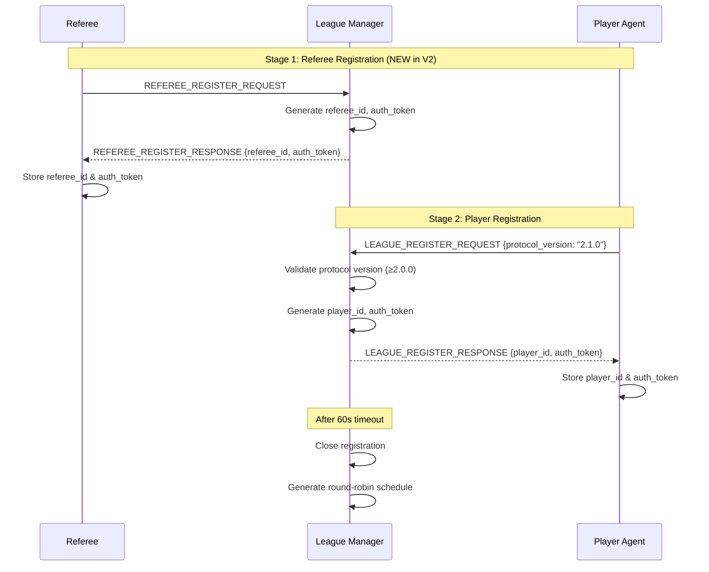
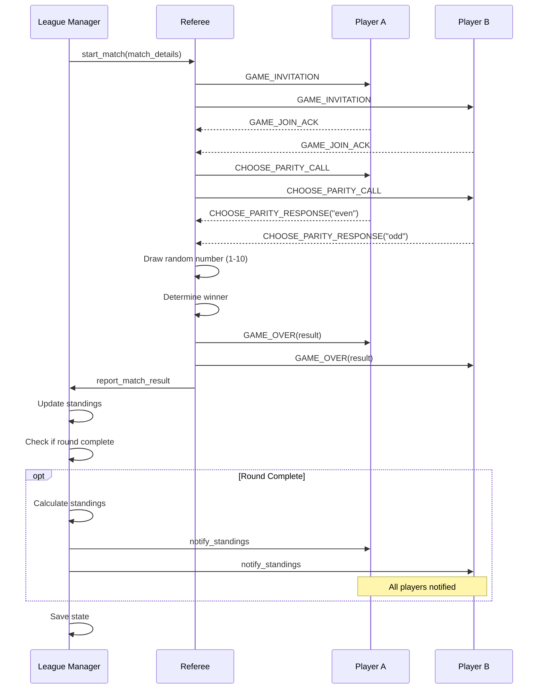

# Even/Odd AI Agent League System

A distributed multi-agent system implementing a competitive Even/Odd game league following **League Protocol V2** specification with **MCP v2024-11-05** and **JSON-RPC 2.0** over HTTP.

## Overview

This project demonstrates AI agent architecture through a functional game league where autonomous agents compete in Even/Odd matches. The system uses a three-layer architecture with clear separation between league management, game refereeing, and specific game logic.

### Key Features

- ✅ **League Protocol V2 Compliant** - 100% adherence to specification including referee registration
- ✅ **Authentication System** - Token-based auth for all post-registration messages
- ✅ **UTC Timestamp Enforcement** - All timestamps validated to UTC timezone
- ✅ **LEAGUE_QUERY Support** - Players can query standings, schedule, stats, and next match
- ✅ **Intelligent Retry Logic** - 3 retries with 2-second delays for timeout/connection errors
- ✅ **Distributed Architecture** - HTTP-based communication enabling local and remote deployment
- ✅ **Parallel Match Execution** - Multiple referee instances for concurrent games
- ✅ **Player Self-Registration** - Autonomous agents register themselves
- ✅ **Pluggable Game Rules** - Easy to extend with new game types
- ✅ **Multiple Strategies** - Random, deterministic, and LLM-based player strategies
- ✅ **Round Standings Notifications** - Real-time standings updates after each round
- ✅ **Comprehensive Logging** - All messages logged to files with full JSON visibility
- ✅ **Clean Modular Code** - All Python files under 200 lines

---

## Repository Schema

The repository follows a modern modular architecture using the `league_sdk` for all shared functionality.

```
L25_HomeWork/
├── SHARED/                      # Shared resources and SDK
│   ├── config/                  # JSON configuration files
│   │   ├── system.json          # System-wide settings (protocol version, etc.)
│   │   ├── agents.json          # All agent definitions and endpoints
│   │   ├── league_*.json        # Individual league configurations
│   │   └── ...
│   ├── data/                    # Runtime data directories (auto-generated)
│   │   ├── standings/           # League standings JSON files
│   │   ├── matches/             # Match history and results
│   │   └── state/               # Persistent agent state
│   ├── logs/                    # JSONL structured logs (auto-generated)
│   │   ├── league_manager/      # League manager logs
│   │   ├── referees/            # Referee logs by ID
│   │   └── players/             # Player logs by ID
│   ├── league_sdk/              # Python SDK for all agents
│   │   ├── __init__.py          # Package exports
│   │   ├── config_models.py    # Dataclasses for configurations (15 classes)
│   │   ├── config_loader.py    # Lazy loading with caching
│   │   ├── repositories.py     # Data access layer (4 repository classes)
│   │   ├── logger.py           # JSONL structured logging
│   │   ├── schemas.py          # Protocol V2 Pydantic models
│   │   ├── helpers.py          # Utility functions (timestamps, IDs, validation)
│   │   ├── mcp_client.py       # MCP client implementation
│   │   ├── mcp_server.py       # MCP server base class
│   │   └── game_rules/         # Game logic modules
│   │       ├── __init__.py
│   │       └── even_odd.py     # Even/Odd game implementation
│   └── pyproject.toml          # SDK packaging configuration
├── agents/                      # Modular agent implementations
│   ├── league_manager/          # League manager (modular structure)
│   │   ├── main.py             # Entry point with SDK integration (~200 lines)
│   │   ├── handlers.py         # Message handling logic (~280 lines)
│   │   ├── scheduler.py        # Round management (~220 lines)
│   │   └── requirements.txt    # Python dependencies
│   ├── referee_template/        # Complete referee template (ready to use)
│   │   ├── main.py             # Entry point and initialization
│   │   ├── handlers.py         # Message handling and match orchestration
│   │   ├── game_logic.py       # Match execution using SDK game rules
│   │   └── requirements.txt    # Python dependencies
│   └── player_template/         # Complete player template (ready to use)
│       ├── main.py             # Entry point and initialization
│       ├── handlers.py         # Message handling and league interaction
│       ├── strategy.py         # Playing strategies (random, deterministic, adaptive)
│       └── requirements.txt    # Python dependencies
├── doc/                         # Documentation and examples
│   ├── diagrams/                # Architecture diagrams
│   │   └── architecture.md     # Mermaid diagrams (system, flows, components)
│   ├── message-examples/        # Protocol V2 message examples
│   │   ├── registration/       # Registration flow examples (4 files)
│   │   ├── game-flow/          # Match execution examples (5 files)
│   │   └── errors/             # Error message examples (3 files)
│   └── protocol-spec.md        # Complete League Protocol V2 specification
├── venv/                        # Virtual environment (gitignored)
├── .gitignore                   # Git ignore rules
├── README.md                    # This file - comprehensive documentation
├── PDR_EvenOdd_League.md        # Complete Product Design Review
└── homework_assignment_English_V2.md  # Assignment specification
```

### Architecture Benefits

**✅ Modular Design**: Clear separation between SDK, agents, and configuration  
**✅ Type Safety**: Dataclass-based configuration and Pydantic schemas  
**✅ Scalability**: Easy to add new agents, leagues, and game types  
**✅ Maintainability**: SDK changes automatically propagate to all agents  
**✅ Clean Code**: All agent files under 300 lines


---

## Architecture

### Three-Layer Design

```
┌──────────────────────────────────────┐
│    Layer 1: League Management        │
│  - Player registration & tracking    │
│  - Round-robin scheduling            │
│  - Standings calculation             │
└────────────┬─────────────────────────┘
             │
             ▼
┌──────────────────────────────────────┐
│    Layer 2: Game Refereeing          │
│  - Match initialization              │
│  - Move collection & validation      │
│  - Winner determination              │
└────────────┬─────────────────────────┘
             │
             ▼
┌──────────────────────────────────────┐
│    Layer 3: Game Rules (Pluggable)   │
│  - Even/Odd game logic               │
│  - Move validation                   │
│  - Winner calculation                │
└──────────────────────────────────────┘
```

### Component Architecture

```
┌────────────────┐  ┌─────────────┐  ┌───────────────┐
│ League Manager │  │  Referees   │  │ Player Agents │
│   Port: 8000   │  │ Ports: 8001 │  │ Ports: 8101-4 │
│                │  │       8002  │  │               │
└────────┬───────┘  └──────┬──────┘  └───────┬───────┘
         │                 │                  │
         └─────────────────┴──────────────────┘
            All communicate via HTTP POST
               JSON-RPC 2.0 to /mcp
```

**Key Design Decisions:**
- **No separate orchestrator** - League Manager and Referee handle their own orchestration
- **League Manager** - Orchestrates league-level operations (registration, scheduling, standings)
- **Referee** - Orchestrates match-level operations (invitations, choice collection, results)
- **Multiple Referees** - For parallel match execution (2 referees for 4 players)

---

## Installation

### Prerequisites

- Python 3.8+
- pip

### Setup

```bash
# Clone the repository
cd /path/to/L25_HomeWork

# Create virtual environment
python3 -m venv venv
source venv/bin/activate  # On Windows: venv\Scripts\activate

# Install common dependencies
pip install -r requirements.txt

# Install the league SDK
cd SHARED
pip install -e .
cd ..
```

### Optional: LLM Strategy

For players using Gemini LLM strategy:

```bash
export GEMINI_API_KEY="your-api-key-here"
```

---

## Quick Start

## League SDK Module

### Overview

The `league_sdk` is a Python library providing a clean abstraction layer for building league agents. It implements type-safe configuration management, structured logging, data repositories, and MCP protocol utilities.

**Location:** `SHARED/league_sdk/`

### Key Features

- ✅ **Type-Safe Configuration** - Dataclass models for all config types
- ✅ **Lazy Loading with Caching** - Efficient configuration access
- ✅ **Repository Pattern** - Clean data access layer for runtime data
- ✅ **JSONL Structured Logging** - Machine-readable logs with full context
- ✅ **MCP Protocol Support** - Complete Protocol V2 schemas and client/server
- ✅ **Pluggable Game Rules** - Easy to add new game types
- ✅ **Reusable Utilities** - Timestamp generation, ID creation, validation

### Installation

```bash
# From project root
cd SHARED
pip install -e .
```

This makes `league_sdk` available to all agents:
```python
from league_sdk import ConfigLoader, JsonLogger, MCPServer
from league_sdk.schemas import LeagueRegisterRequest
from league_sdk.helpers import generate_utc_timestamp
```

### SDK Modules

#### 1. Configuration Management

**`config_models.py`** - 15 dataclasses for type-safe configs:
```python
@dataclass
class SystemConfig:
    protocol_version: str
    mcp_version: str
    retry_policy: RetryPolicy

@dataclass
class AgentConfig:
    agent_id: str
    agent_type: str
    endpoint: str
    display_name: str
```

**`config_loader.py`** - Centralized configuration loading:
```python
from league_sdk import ConfigLoader

loader = ConfigLoader()  # Defaults to SHARED/config/

# Load system configuration
system = loader.load_system()
print(system.protocol_version)  # "league.v2"

# Load all agents
agents = loader.load_agents()
players = loader.get_active_players()

# Load specific league
league = loader.load_league("league_2025_even_odd")
```

#### 2. Structured Logging

**`logger.py`** - JSONL logging with full context:
```python
from league_sdk import JsonLogger

logger = JsonLogger("player_01", league_id="league_2025_even_odd")

# Log with structured data
logger.info("MATCH_STARTED", match_id="R1M1", opponent="P02")
logger.error("CONNECTION_FAILED", endpoint="http://localhost:8000", retry=3)

# Outputs JSONL:
# {"timestamp": "2025-12-15T00:30:00Z", "level": "INFO", "event": "MATCH_STARTED", 
#  "agent_id": "player_01", "league_id": "league_2025_even_odd", "match_id": "R1M1", ...}
```

#### 3. Data Repositories

**`repositories.py`** - Clean data access layer:
```python
from league_sdk import StandingsRepository, MatchRepository

# Standings repository
standings_repo = StandingsRepository("league_2025_even_odd")
standings_repo.update_player("P01", result="WIN", points=3)
current_standings = standings_repo.load()

# Match repository
match_repo = MatchRepository("league_2025_even_odd")
match_repo.save_result({
    "match_id": "R1M1",
    "winner": "P01",
    "score": {"P01": "even", "P02": "odd"}
})
```

#### 4. MCP Protocol

**`schemas.py`** - Complete Protocol V2 Pydantic models:
```python
from league_sdk.schemas import (
    LeagueRegisterRequest,
    LeagueRegisterResponse,
    GameInvitation,
    ChooseParityCall,
    # ... all 18 message types
)

# Type-safe message creation
request = LeagueRegisterRequest(
    protocol="league.v2",
    message_type="LEAGUE_REGISTER_REQUEST",
    sender="player:P01",
    display_name="Alpha Bot",
    agent_version="1.0.0",
    supported_game_types=["even_odd"]
)
```

**`mcp_server.py`** - Base class for MCP servers:
```python
from league_sdk import MCPServer

class MyAgent(MCPServer):
    def __init__(self):
        super().__init__("my_agent", "1.0.0")
        
    def setup_tools(self):
        self.add_tool("my_tool", self.handle_my_tool, {
            "type": "object",
            "properties": {"param": {"type": "string"}},
            "required": ["param"]
        })
        
    async def handle_my_tool(self, param: str):
        return {"result": f"Processed: {param}"}
```

**`mcp_client.py`** - HTTP client for MCP calls:
```python
from league_sdk import MCPClient

client = MCPClient("http://localhost:8000/mcp")

# Call tool with retry logic
result = await client.call_tool(
    "register_player",
    {"display_name": "Alpha", "version": "1.0.0"}
)
```

#### 5. Utilities

**`helpers.py`** - Common utility functions:
```python
from league_sdk.helpers import (
    generate_utc_timestamp,     # ISO-8601 UTC timestamp
    generate_player_id,         # Unique player ID
    generate_auth_token,        # Authentication token
    validate_parity_choice,     # Check "even" or "odd"
)

timestamp = generate_utc_timestamp()  # "2025-12-15T00:30:00Z"
player_id = generate_player_id()      # "P01", "P02", ...
token = generate_auth_token("P01")    # "tok_P01_xyz..."
```

### Modular Architecture Pattern

The SDK enables clean separation of concerns. Example from `agents/league_manager/`:

**`main.py`** - Entry point and initialization:
```python
from league_sdk import ConfigLoader, JsonLogger, MCPServer
from handlers import setup_handlers
from scheduler import RoundScheduler

def main():
    loader = ConfigLoader()
    logger = JsonLogger("league_manager")
    
    server = MCPServer("league_manager", "2.0")
    setup_handlers(server, logger)
    
    scheduler = RoundScheduler(loader, logger)
    scheduler.start()
```

**`handlers.py`** - Message handling logic (280 lines):
```python
def setup_handlers(server, logger):
    server.add_tool("register_player", handle_register_player, {...})
    server.add_tool("report_match_result", handle_match_result, {...})
    # ... all handler setup

async def handle_register_player(display_name, version):
    # Registration logic
    ...
```

**`scheduler.py`** - Round management (220 lines):
```python
class RoundScheduler:
    def __init__(self, config_loader, logger):
        self.config = config_loader.load_league(...)
        self.logger = logger
        
    async def start_round(self, round_id):
        # Round execution logic
        ...
```

### Benefits of SDK Architecture

1. **Code Reusability** - Write once, use in all agents
2. **Type Safety** - Dataclasses catch errors at development time
3. **Consistency** - All agents use same config format and logging
4. **Maintainability** - Changes to SDK automatically propagate to all agents
5. **Testability** - Mock SDK components for unit testing
6. **Scalability** - Easy to add new leagues, agents, game types

---

## Modular Agent Architecture

### Section 11 Pattern Implementation

The new `agents/` directory demonstrates the recommended modular pattern for building scalable league agents.

### Example: Modular League Manager

Located in `agents/league_manager/`, this shows how to split a 719-line monolithic file into focused modules:

**File Structure:**
```
agents/league_manager/
├── main.py          # ~200 lines - Entry point, server setup
├── handlers.py      # ~280 lines - All tool handlers
├── scheduler.py     # ~220 lines - Round scheduling logic
└── requirements.txt # Dependencies
```

**Key Improvements:**
- ✅ Each file has a single responsibility
- ✅ All files under 300 lines (easier to understand)
- ✅ Uses SDK for configuration, logging, utilities
- ✅ Clean imports and dependencies
- ✅ Easier to test individual modules

### Running Modular Agents

```bash
# Install SDK first
cd SHARED
pip install -e .

# Install agent dependencies
cd ../agents/league_manager
pip install -r requirements.txt

# Run modular league manager
python main.py --league-id league_2025_even_odd
```

### Templates for New Agents

The repository includes complete, ready-to-use templates demonstrating modular architecture:

**Referee Template** (`agents/referee_template/`):
- **`main.py`** - Entry point with server setup and initialization
- **`handlers.py`** - Complete message handling (invitations, parity collection, results)
- **`game_logic.py`** - Match execution using SDK game rules
- **`requirements.txt`** - All necessary dependencies

**Player Template** (`agents/player_template/`):
- **`main.py`** - Entry point with server setup and initialization
- **`handlers.py`** - Complete message handling (registration, game participation, queries)
- **`strategy.py`** - Multiple strategies (random, deterministic, adaptive, LLM-ready)
- **`requirements.txt`** - All necessary dependencies

Both templates are fully functional and ready to customize with:
- Your own ports and configuration
- Custom strategies (for players)
- Enhanced game logic (for referees)
- Additional features and capabilities

---

## Quick Start
### Prerequisites

- Python 3.8+
- pip
- 7 terminal windows (1 League Manager + 2 Referees + 4 Players)

### Installation

```bash
# Navigate to project directory
cd /path/to/L25_HomeWork

# Create virtual environment
python3 -m venv venv
source venv/bin/activate  # On Windows: venv\\Scripts\\activate

# Install common dependencies
pip install -r requirements.txt

# Install the league SDK
cd SHARED
pip install -e .
cd ..
```

### Optional: LLM Strategy

For players using Gemini LLM strategy:

```bash
export GEMINI_API_KEY="your-api-key-here"
```

---

## Running the League (4 Players, 2 Referees)

This guide provides **detailed step-by-step instructions** to run a complete league locally with 4 players and 2 referees.

### Step 1: Prepare Agent Directories

First, create the necessary agent instances from templates:

```bash
# From project root: /path/to/L25_HomeWork

# Create 2 referee instances
cp -r agents/referee_template agents/referee_REF01
cp -r agents/referee_template agents/referee_REF02

# Create 4 player instances
cp -r agents/player_template agents/player_P01
cp -r agents/player_template agents/player_P02
cp -r agents/player_template agents/player_P03
cp -r agents/player_template agents/player_P04
```

### Step 2: Install Dependencies for All Agents

```bash
# Install league_manager dependencies
cd agents/league_manager
pip install -r requirements.txt
cd ../..

# Install referee dependencies
cd agents/referee_REF01
pip install -r requirements.txt
cd ../..

cd agents/referee_REF02
pip install -r requirements.txt
cd ../..

# Install player dependencies
cd agents/player_P01
pip install -r requirements.txt
cd ../..

cd agents/player_P02
pip install -r requirements.txt
cd ../..

cd agents/player_P03
pip install -r requirements.txt
cd ../..

cd agents/player_P04
pip install -r requirements.txt
cd ../..
```

### Step 3: Start All Agents (7 Terminals)

Open **7 separate terminal windows** and activate the virtual environment in each:

```bash
# In each terminal:
cd /path/to/L25_HomeWork
source venv/bin/activate  # On Windows: venv\\Scripts\\activate
```

#### Terminal 1: League Manager (Port 8000)

```bash
cd agents/league_manager
python main.py --league-id league_2025_even_odd
```

**Expected output:** `League Manager started on http://localhost:8000`

---

#### Terminal 2: Referee #1 (Port 8001)

```bash
cd agents/referee_REF01
python main.py --referee-id REF01 --port 8001 --league-manager http://localhost:8000/mcp
```

**Expected output:** `Referee REF01 started on http://localhost:8001`

---

#### Terminal 3: Referee #2 (Port 8002)

```bash
cd agents/referee_REF02
python main.py --referee-id REF02 --port 8002 --league-manager http://localhost:8000/mcp
```

**Expected output:** `Referee REF02 started on http://localhost:8002`

---

#### Terminal 4: Player #1 (Port 8101)

```bash
cd agents/player_P01
python main.py --player-id P01 --port 8101 --strategy random --league-manager http://localhost:8000/mcp
```

**Expected output:** `Player P01 started on http://localhost:8101`

---

#### Terminal 5: Player #2 (Port 8102)

```bash
cd agents/player_P02
python main.py --player-id P02 --port 8102 --strategy always_even --league-manager http://localhost:8000/mcp
```

**Expected output:** `Player P02 started on http://localhost:8102`

---

#### Terminal 6: Player #3 (Port 8103)

```bash
cd agents/player_P03
python main.py --player-id P03 --port 8103 --strategy always_odd --league-manager http://localhost:8000/mcp
```

**Expected output:** `Player P03 started on http://localhost:8103`

---

#### Terminal 7: Player #4 (Port 8104)

```bash
cd agents/player_P04
python main.py --player-id P04 --port 8104 --strategy alternating --league-manager http://localhost:8000/mcp
```

**Expected output:** `Player P04 started on http://localhost:8104`

---

### Step 4: Watch the League Run

**What happens next:**

1. **Registration Phase (60 seconds)**
   - Referees register with League Manager
   - Players self-register with League Manager
   - League Manager generates round-robin schedule (6 matches total)

2. **Match Execution Phase**
   - Referees orchestrate matches in parallel
   - Players receive invitations and make choices
   - Match results reported back to League Manager

3. **Standings Updates**
   - After each round completes, all players receive standings notifications
   - League Manager logs intermediate standings

4. **Final Results**
   - League Manager calculates final standings
   - Winner announced with complete statistics

### Step 5: View Logs and Results

All structured logs are saved in JSONL format:

```bash
# League Manager logs
tail -f SHARED/logs/league_manager/league_2025_even_odd.jsonl

# Referee logs
tail -f SHARED/logs/referees/REF01.jsonl
tail -f SHARED/logs/referees/REF02.jsonl

# Player logs
tail -f SHARED/logs/players/P01.jsonl
tail -f SHARED/logs/players/P02.jsonl
tail -f SHARED/logs/players/P03.jsonl
tail -f SHARED/logs/players/P04.jsonl

# Final standings
cat SHARED/data/standings/league_2025_even_odd.json
```

---

### Available Player Strategies

You can customize player strategies when starting them:

- `random` - Randomly chooses "even" or "odd"
- `always_even` - Always chooses "even"
- `always_odd` - Always chooses "odd"
- `alternating` - Alternates between "even" and "odd"
- `adaptive` - Adapts based on opponent history (requires context)
- `llm` - Uses Gemini LLM (requires `GEMINI_API_KEY`)

**Example:**
```bash
python main.py --player-id P01 --port 8101 --strategy llm --league-manager http://localhost:8000/mcp
```

---

### Troubleshooting

**Port already in use:**
```bash
# Find process using port 8000
lsof -ti:8000 | xargs kill -9

# Or change the port when starting agents
python main.py --port 8005
```

**Connection errors:**
- Ensure League Manager starts first (Terminal 1)
- Ensure all agents use correct League Manager endpoint
- Check firewall settings allow localhost connections

**Registration timeout:**
- Start all players within 60 seconds of League Manager startup
- Increase timeout in `SHARED/config/leagues/league_2025_even_odd.json`

---

### Quick Restart

To quickly restart the entire league:

```bash
# Kill all Python processes (use with caution!)
pkill -f "python main.py"

# Then restart each terminal following Step 3
```

---

## System Flows

### 1. Registration Flow (Protocol V2)



**Protocol V2 Changes:**
- ✅ Referee registration required before matches
- ✅ Auth tokens issued to all agents
- ✅ Protocol version validation (minimum 2.0.0)
- ✅ All subsequent messages require auth_token

**Registration Timeout:**
- Configurable (default: 60 seconds)
- Players joining after timeout are rejected
- Ensures all players ready before schedule creation

---

### 2. Match Execution Flow



**Key Timeouts:**
- `GAME_JOIN_ACK`: 5 seconds
- `CHOOSE_PARITY_RESPONSE`: 30 seconds
- Timeout = Technical Loss

**Retry Logic (Protocol V2 Compliant):**
- **E001 (Timeout)**: Retry up to 3 times with 2-second delays
- **E009 (Connection)**: Retry up to 3 times with 2-second delays  
- **Other errors**: Immediate failure (no retry)
- After 3 failed retries: TECHNICAL_LOSS declared

---

### 3. Standings Calculation Flow

```
For each match result:
  ├─ Winner gets 3 points
  ├─ Loser gets 0 points
  └─ Draw: both get 1 point

Tie-breaking order:
  1. Total points (descending)
  2. Number of wins (descending)
  3. Number of draws (descending)
  4. Alphabetical by player_id
```

**Example Standings:**
```
Rank | Player | Played | Wins | Draws | Losses | Points
-----|--------|--------|------|-------|--------|-------
  1  |  P01   |   3    |  2   |   1   |   0    |   7
  2  |  P02   |   3    |  2   |   0   |   1    |   6
  3  |  P03   |   3    |  1   |   1   |   1    |   4
  4  |  P04   |   3    |  0   |   0   |   3    |   0
```

---

### 4. Complete League Workflow

```
┌─────────────────────┐
│ 1. Startup          │
│ - Start all agents  │
│ - Players wait      │
└──────────┬──────────┘
           │
           ▼
┌─────────────────────┐
│ 2. Registration     │
│ - Players self-reg  │    ┌──────────────┐
│ - 60s timeout       │───→│ Late players │
│                     │    │ rejected     │
└──────────┬──────────┘    └──────────────┘
           │
           ▼
┌─────────────────────┐
│ 3. Schedule         │
│ - Round-robin gen   │
│ - 4 players = 6     │
│   matches           │
└──────────┬──────────┘
           │
           ▼
┌─────────────────────┐
│ 4. Match Execution  │
│ - Parallel matches  │
│ - 2 referees handle │
│   2 matches at once │
└──────────┬──────────┘
           │
           ▼
┌─────────────────────┐
│ 5. Results          │
│ - Update standings  │
│ - Save state        │
└──────────┬──────────┘
           │
           ▼
┌─────────────────────┐
│ 6. Final Standings  │
│ - Calculate rank    │
│ - Display results   │
└─────────────────────┘
```

---

## Game Rules: Even/Odd

### Gameplay

1. **Setup**: Two players are matched
2. **Choice**: Each player secretly chooses "even" or "odd"
3. **Draw**: Referee draws random number (1-10)
4. **Winner**: Player whose choice matches the number's parity wins

### Win Conditions

```python
if choice_A == choice_B:
    result = "DRAW"  # Same choice always = draw
elif drawn_number % 2 == 0:
    winner = player who chose "even"
else:
    winner = player who chose "odd"
```

**Important:** If both players choose the same option (both "even" or both "odd"), the result is **always a draw**, regardless of the drawn number.

### Scoring

- **Win**: 3 points
- **Draw**: 1 point each
- **Loss**: 0 points

### Valid Choices

```python
parity_choice in ["even", "odd"]  # Must be lowercase!
```

**Invalid choices:**
- ❌ "EVEN", "Even", "ODD", "Odd"
- ❌ "0", "1", "true", "false"
- ✅ "even", "odd"

---

## Player Strategies

### 1. Random Strategy
```python
choice = random.choice(["even", "odd"])
```

**Usage:** Implement in your player agent based on `agents/player_template/`

### 2. Always Even
```python
choice = "even"  # Always choose even
```

**Usage:** Implement in your player agent based on `agents/player_template/`

### 3. Always Odd
```python
choice = "odd"  # Always choose odd
```

**Usage:** Implement in your player agent based on `agents/player_template/`

### 4. LLM Strategy (Gemini)
```python
# Uses Gemini API with context and history
choice = gemini_choose(context, history)
# Falls back to random if API unavailable
```

**Usage:** Implement in your player agent based on `agents/player_template/` with Gemini API integration

---

## Configuration

Configuration is managed through JSON files in `SHARED/config/`:

- `system.json` - System-wide settings (protocol version, MCP version, retry policy)
- `agents.json` - All agent definitions and endpoints
- `league_*.json` - Individual league configurations

**Example league configuration:**
```json
{
  "league_id": "league_2025_even_odd",
  "game_type": "even_odd",
  "registration_timeout": 60,
  "max_players": 100,
  "rounds": 1
}
```

### Multi-Machine Deployment

For distributed deployment, update hosts:

```yaml
league_manager:
  host: "192.168.1.10"  # Machine A
  port: 8000

referees:
  - host: "192.168.1.10"
    port: 8001

players:
  - name: "Player1"
    host: "192.168.1.11"  # Machine B
    port: 8101
```

---

## Monitoring and Debugging

### Log Files

All components write to `logs/` directory with both console output and file logging:

**Log Files Created:**
- `league_manager.log` - League orchestration and standings
- `referee_8001.log` - Match execution for referee on port 8001
- `referee_8002.log` - Match execution for referee on port 8002  
- `player_Alpha_8101.log` - Alpha player activity
- `player_Beta_8102.log` - Beta player activity
- `player_Gamma_8103.log` - Gamma player activity
- `player_Delta_8104.log` - Delta player activity

**Viewing Logs:**
```bash
# View League Manager logs
tail -f logs/league_manager.log

# View Referee logs
tail -f logs/referee_8001.log

# View Player logs  
tail -f logs/player_Alpha_8101.log
```

**JSON Message Logging:**

All MCP messages are logged with full JSON payloads for complete visibility:

```
2025-12-13 20:30:00 - utils.mcp_client - INFO - [SEND → http://localhost:8101/mcp] {
  "jsonrpc": "2.0",
  "method": "tools/call",
  "params": {
    "name": "choose_parity",
    "arguments": {
      "match_id": "R1M1",
      "player_id": "P01",
      ...
    }
  },
  "id": 123456
}

2025-12-13 20:30:00 - utils.mcp_client - INFO - [RECV ← http://localhost:8101/mcp] {
  "jsonrpc": "2.0",
  "result": {
    "content": [{"type": "text", "text": "{...}"}]
  },
  "id": 123456
}
```

**Benefits:**
- 📝 Complete audit trail of all agent communications
- 🐛 Easy debugging with full message visibility
- 📊 Protocol compliance verification
- 🔍 Message flow analysis

### State Files

Check `data/league_state.json` for:
- Registered players
- Match schedule
- Match results
- Current standings

### Testing Endpoints

```bash
# Check if agent is running
curl http://localhost:8000/mcp -X POST -H "Content-Type: application/json" \
  -d '{"jsonrpc":"2.0","method":"initialize","id":1}'

# List available tools
curl http://localhost:8000/mcp -X POST -H "Content-Type: application/json" \
  -d '{"jsonrpc":"2.0","method":"tools/list","id":1}'
```

---

## Troubleshooting

### Problem: Players not registering

**Solution:**
1. Check players started within 60s window
2. Verify league manager is running: `curl http://localhost:8000/mcp`
3. Check player logs for registration errors

### Problem: "Method not found" error

**Cause:** Tool name mismatch

**Solution:** Verify tool names match exactly:
- `register_player`
- `handle_game_invitation`
- `choose_parity`
- `notify_match_result`

### Problem: "Invalid parity choice"

**Cause:** Choice not lowercase "even" or "odd"

**Solution:** Ensure player returns exactly `"even"` or `"odd"` (lowercase)

### Problem: Matches timing out

**Cause:** Player response too slow

**Solution:**
- Check player logic complexity
- Verify network latency
- Review timeout values in code

### Problem: Port already in use

**Solution:**
```bash
# Find and kill process using port
lsof -ti:8000 | xargs kill -9

# Or change port in config
```

---

## Recent Improvements

### League Protocol V2 Compliance (December 2025)

**Status:** ✅ **100% Compliant** with League Protocol V2 specification

**Major V2 Features Implemented:**

1. **Referee Registration** - Referees must register with league manager before judging matches
2. **Authentication System** - Token-based authentication for all agents post-registration  
3. **UTC Timestamp Validation** - All timestamps enforced to UTC timezone (ISO-8601 with Z suffix)
4. **Protocol Version Checking** - Validates agents support minimum version 2.0.0
5. **LEAGUE_QUERY Feature** - Players can query league information:
   - `GET_STANDINGS` - Current league standings
   - `GET_SCHEDULE` - Full match schedule
   - `GET_NEXT_MATCH` - Find next match for player
   - `GET_PLAYER_STATS` - Detailed player statistics
6. **Retry Policy** - 3 retries with 2-second delays for timeout/connection errors only
7. **Spec-Compliant Messages** - All 18 message types from Protocol V2 specification

**Example LEAGUE_QUERY Usage:**
```python
# Player queries for next match
query_msg = {
    "protocol": "league.v2",
    "message_type": "LEAGUE_QUERY",
    "sender": "player:P01",
    "auth_token": "tok_P01_abc123...",
    "query_type": "GET_NEXT_MATCH",
    "query_params": {"player_id": "P01"}
}

# Response includes match details
{
    "success": true,
    "data": {
        "next_match": {
            "match_id": "R2M1",
            "opponent_id": "P03",
            "referee_endpoint": "http://localhost:8001/mcp"
        }
    }
}
```

### Round Standings Notifications (December 2025)

**Feature:** Real-time standings updates after each round completes.

**Message Type:** `LEAGUE_STANDINGS_UPDATE` (per Protocol V2 spec)

**How It Works:**
1. League manager tracks match completion per round
2. When all matches in a round finish, standings are calculated
3. All players receive `LEAGUE_STANDINGS_UPDATE` message with current rankings
4. Players log formatted standings table highlighting their position

**Player Log Output:**
```
============================================================
STANDINGS AFTER ROUND 1/3
============================================================
Rank   Player       Played   W    D    L    Points  
------------------------------------------------------------
1      P03          2        2    0    0    6       
2      P01          2        1    1    0    4       
3      P04          2        1    0    1    3       
4      P02          2        0    1    1    1       

My position: #2 with 4 points
============================================================
```

**Benefits:**
- ✅ Players stay informed of league progression
- ✅ Real-time feedback after each round
- ✅ Motivation and engagement throughout competition
- ✅ Full transparency of standings

### Comprehensive Logging System (December 2025)

**Features:**
1. **File-based Logging** - All logs saved to `logs/` directory
2. **JSON Message Logging** - Complete MCP protocol messages logged
3. **Component-specific Logs** - Separate log files per component

**Technical Implementation:**
- `setup_logging()` helper configures both console and file handlers
- Automatic log directory creation
- Pretty-printed JSON with 2-space indentation
- `[SEND →]` and `[RECV ←]` prefixes for message direction

**Log File Configuration:**
```yaml
logging:
  level: "INFO"      # DEBUG, INFO, WARNING, ERROR
  directory: "logs"  # Log file directory
```

### Final Results Display & Match Reporting (December 2025)

**Issues Fixed:**
1. League manager now properly waits for all match results before displaying final standings
2. Referees now correctly report match results back to the league manager

**Technical Changes:**
- **League Manager (`league_manager.py`)**: Added match completion tracking with wait loop
- **Referee (`referee.py`)**: Added result reporting to league manager after each match completes
- **Enhanced Output**: Comprehensive final standings table with detailed statistics and winner announcement

**New Output Format:**
```
============================================================
  LEAGUE COMPLETE - FINAL RESULTS
============================================================

League: league_2025_even_odd
Total Matches Played: 6
Total Players: 4

------------------------------------------------------------
FINAL STANDINGS
------------------------------------------------------------
Rank   Player       Played   W    D    L    Points  
------------------------------------------------------------
1      P01          3        2    1    0    7       
2      P02          3        2    0    1    6       
3      P03          3        1    0    2    3       
4      P04          3        0    1    2    1       

============================================================
  🏆 WINNER ANNOUNCEMENT 🏆
============================================================

Congratulations to P01 - Alpha!
Final Score: 7 points (2 wins, 1 draws, 0 losses)

============================================================
```

---

## Extending the System

### Adding a New Game Type

1. Create `SHARED/league_sdk/game_rules/your_game.py`:
```python
class YourGameRules:
    def validate_choice(self, choice):
        # Your validation logic
        pass
    
    def determine_winner(self, choice_A, choice_B, ...):
        # Your winner logic
        pass
```

2. Update SDK exports in `SHARED/league_sdk/__init__.py`

3. Create referee and player agents using the templates in `agents/`

4. Configure new game type in `SHARED/config/` JSON files

### Scaling to More Players

**For 50 players:**
```yaml
referees:  # 25 referees for parallel execution
  - {host: "localhost", port: 8001}
  - {host: "localhost", port: 8002}
  # ... add 23 more
```

**Total matches for N players:** N × (N - 1) / 2
- 4 players: 6 matches
- 10 players: 45 matches
- 50 players: 1,225 matches

---

## MCP Protocol Reference

### JSON-RPC 2.0 Structure

```json
{
  "jsonrpc": "2.0",
  "method": "tools/call",
  "params": {
    "name": "tool_name",
    "arguments": { ... }
  },
  "id": 1
}
```

### Common Message Fields

**Protocol V2 Envelope (Required Fields):**
```json
{
  "protocol": "league.v2",
  "message_type": "...",
  "sender": "league_manager" or "player:P01" or "referee:REF01",
  "timestamp": "2025-01-15T10:30:00Z",
  "conversation_id": "conv-...",
  "auth_token": "tok_..."  // Required after registration
}
```

Game messages also include:
- `match_id`
- `round_id`

Player messages also include:
- `player_id`

---

## Performance Considerations

### Sequential vs Parallel Execution

**4 Players (6 matches):**
- Sequential: ~6 minutes
- Parallel (2 referees): ~3 minutes

**50 Players (1,225 matches):**
- Sequential: ~20 hours
- Parallel (25 referees): ~1 hour

### Resource Usage

- League Manager: ~50MB RAM
- Each Referee: ~30MB RAM
- Each Player: ~20MB RAM

**Total for 4 players + 2 referees:**
~170MB RAM

---

## References

- **Full Product Design Review**: [PDR_EvenOdd_League.md](PDR_EvenOdd_League.md) - Complete specification and design
- **Assignment Specification**: [homework_assignment_English_V2.md](homework_assignment_English_V2.md) - Original assignment
- **MCP Specification**: https://modelcontextprotocol.io/
- **JSON-RPC 2.0**: https://www.jsonrpc.org/specification
- **Gemini API**: https://ai.google.dev/

---

## License

This project is created for educational purposes as part of AI Agent Development coursework.

---

## Author

Created using Gemini AI Assistant as part of Lesson 25 Homework Assignment.

**Version:** 2.0 (League Protocol V2 Compliant)  
**Date:** December 2025

---

## Summary

This Even/Odd AI Agent League demonstrates:
- ✅ **League Protocol V2** - 100% specification compliance
- ✅ Distributed multi-agent systems with authentication
- ✅ MCP protocol implementation  
- ✅ Referee and player registration workflows
- ✅ Query-based information retrieval (LEAGUE_QUERY)
- ✅ Autonomous agent registration
- ✅ Parallel task execution with retry logic
- ✅ Round-by-round standings notifications
- ✅ Comprehensive logging with JSON message visibility
- ✅ Clean, modular code architecture
- ✅ All Python files under 200 lines

Perfect for learning AI agent architecture, MCP protocol, and League Protocol V2! 🚀

---

## References

1. Y. Segal, *AI Agents with MCP*. Dr. Yoram Segal, 2025, Hebrew edition.

2. Anthropic, *Model context protocol specification*, 2024. [Online]. Available: https://modelcontextprotocol.io/

3. JSON-RPC Working Group, *Json-rpc 2.0 specification*, 2010. [Online]. Available: https://www.jsonrpc.org/specification

4. K. Stratis, *AI Agents with MCP*. O'Reilly Media, 2025, Early Release.

