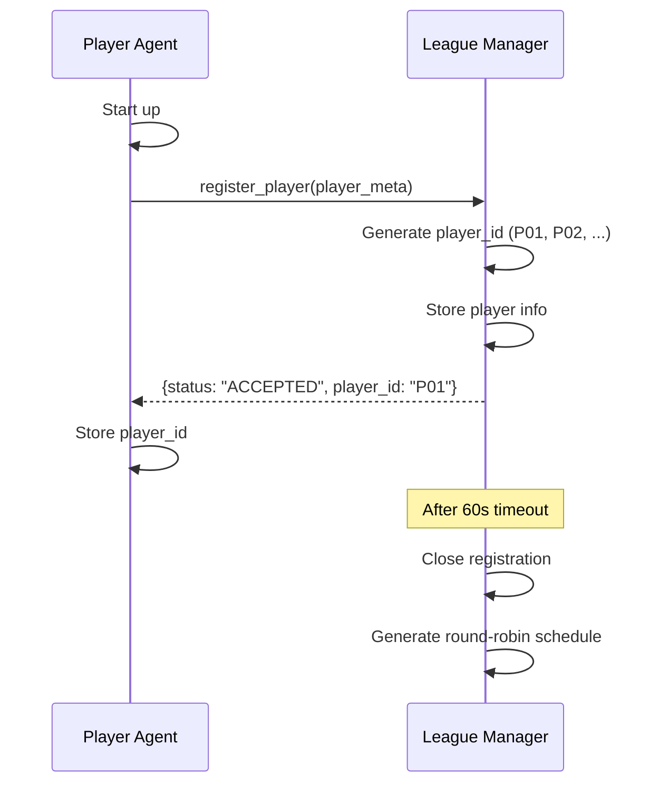
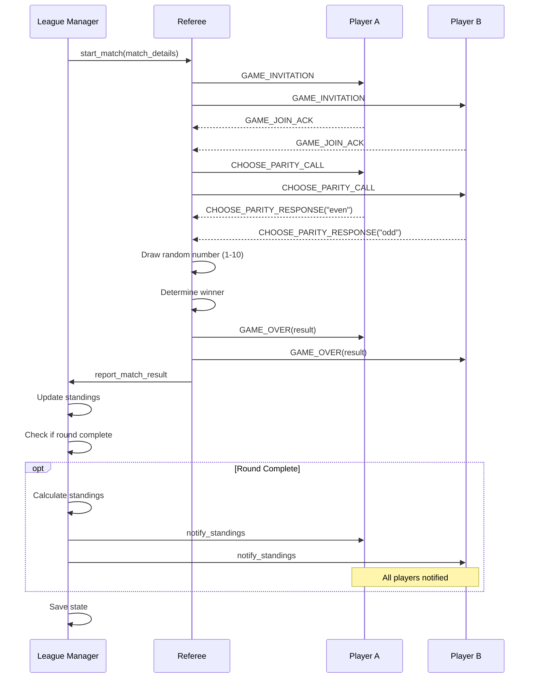

# Even/Odd AI Agent League System

A distributed multi-agent system implementing a competitive Even/Odd game league using the **Model Context Protocol (MCP) v2024-11-05** with **JSON-RPC 2.0** over HTTP.

## Overview

This project demonstrates AI agent architecture through a functional game league where autonomous agents compete in Even/Odd matches. The system uses a three-layer architecture with clear separation between league management, game refereeing, and specific game logic.

### Key Features

- ✅ **MCP Protocol Compliance** - Full adherence to MCP v2024-11-05 specification
- ✅ **Distributed Architecture** - HTTP-based communication enabling local and remote deployment
- ✅ **Parallel Match Execution** - Multiple referee instances for concurrent games
- ✅ **Player Self-Registration** - Autonomous agents register themselves
- ✅ **Pluggable Game Rules** - Easy to extend with new game types
- ✅ **Multiple Strategies** - Random, deterministic, and LLM-based player strategies
- ✅ **Round Standings Notifications** - Real-time standings updates after each round
- ✅ **Comprehensive Logging** - All messages logged to files with full JSON visibility
- ✅ **Clean Modular Code** - All Python files under 150 lines

---

## Repository Schema

```
even_odd_league/
├── src/                          # Source code
│   ├── league_manager.py        # League orchestration (145 lines)
│   ├── referee.py               # Match execution (148 lines)
│   ├── player_agent.py          # Player implementation (147 lines)
│   ├── game_rules/
│   │   ├── __init__.py
│   │   └── even_odd.py          # Even/Odd game logic (85 lines)
│   └── utils/
│       ├── __init__.py
│       ├── mcp_server.py        # MCP server base class (95 lines)
│       ├── mcp_client.py        # MCP client wrapper (76 lines)
│       ├── schemas.py           # Pydantic models (128 lines)
│       └── helpers.py           # Utility functions (102 lines)
├── config/
│   └── local_config.yaml        # Local testing configuration
├── scripts/
│   └── start_league.sh          # Launch script for all components
├── data/                        # Runtime data (auto-generated)
│   ├── league_state.json        # Persistent league state
│   └── match_history.json       # Match audit trail
├── logs/                        # Log files (auto-generated)
│   ├── league_manager.log
│   ├── referee_8001.log
│   ├── referee_8002.log
│   └── player_*.log
├── requirements.txt             # Python dependencies
├── .gitignore                   # Git ignore rules
├── README.md                    # This file
├── PDR_EvenOdd_League.md        # Complete Product Design Review
├── QUICK_REFERENCE.md           # Quick reference guide
└── Development_Decisions_and_Missing_Info.md  # Design decisions log
```

---

## Architecture

### Three-Layer Design

```
┌──────────────────────────────────────┐
│    Layer 1: League Management        │
│  - Player registration & tracking    │
│  - Round-robin scheduling            │
│  - Standings calculation             │
└────────────┬─────────────────────────┘
             │
             ▼
┌──────────────────────────────────────┐
│    Layer 2: Game Refereeing          │
│  - Match initialization              │
│  - Move collection & validation      │
│  - Winner determination              │
└────────────┬─────────────────────────┘
             │
             ▼
┌──────────────────────────────────────┐
│    Layer 3: Game Rules (Pluggable)   │
│  - Even/Odd game logic               │
│  - Move validation                   │
│  - Winner calculation                │
└──────────────────────────────────────┘
```

### Component Architecture

```
┌────────────────┐  ┌─────────────┐  ┌───────────────┐
│ League Manager │  │  Referees   │  │ Player Agents │
│   Port: 8000   │  │ Ports: 8001 │  │ Ports: 8101-4 │
│                │  │       8002  │  │               │
└────────┬───────┘  └──────┬──────┘  └───────┬───────┘
         │                 │                  │
         └─────────────────┴──────────────────┘
            All communicate via HTTP POST
               JSON-RPC 2.0 to /mcp
```

**Key Design Decisions:**
- **No separate orchestrator** - League Manager and Referee handle their own orchestration
- **League Manager** - Orchestrates league-level operations (registration, scheduling, standings)
- **Referee** - Orchestrates match-level operations (invitations, choice collection, results)
- **Multiple Referees** - For parallel match execution (2 referees for 4 players)

---

## Installation

### Prerequisites

- Python 3.8+
- pip

### Setup

```bash
# Clone the repository
cd /path/to/L25_HomeWork

# Create virtual environment
python3 -m venv venv
source venv/bin/activate  # On Windows: venv\Scripts\activate

# Install dependencies
pip install -r requirements.txt
```

### Optional: LLM Strategy

For players using Gemini LLM strategy:

```bash
export GEMINI_API_KEY="your-api-key-here"
```

---

## Quick Start

### Option 1: Automated Launch (Recommended)

```bash
# Make script executable (first time only)
chmod +x scripts/start_league.sh

# Launch all components
./scripts/start_league.sh
```

This starts:
- League Manager on port 8000
- 2 Referees on ports 8001, 8002
- 4 Players on ports 8101-8104 with different strategies

### Option 2: Manual Launch

Open 7 separate terminals:

**Terminal 1 - League Manager:**
```bash
python src/league_manager.py --config config/local_config.yaml
```

**Terminal 2-3 - Referees:**
```bash
python src/referee.py --port 8001
python src/referee.py --port 8002
```

**Terminal 4-7 - Players:**
```bash
python src/player_agent.py --port 8101 --strategy random --name "Alpha"
python src/player_agent.py --port 8102 --strategy always_even --name "Beta"
python src/player_agent.py --port 8103 --strategy always_odd --name "Gamma"
python src/player_agent.py --port 8104 --strategy random --name "Delta"
```

---

## System Flows

### 1. Player Registration Flow



**Registration Timeout:**
- Configurable (default: 60 seconds)
- Players joining after timeout are rejected
- Ensures all players ready before schedule creation

---

### 2. Match Execution Flow



**Key Timeouts:**
- `GAME_JOIN_ACK`: 5 seconds
- `CHOOSE_PARITY_RESPONSE`: 30 seconds
- Timeout = Technical Loss

**Retry Logic:**
- Invalid parity choice: retry up to 3 times
- Network failure: retry once
- Timeout: immediate failure (no retry)

---

### 3. Standings Calculation Flow

```
For each match result:
  ├─ Winner gets 3 points
  ├─ Loser gets 0 points
  └─ Draw: both get 1 point

Tie-breaking order:
  1. Total points (descending)
  2. Number of wins (descending)
  3. Number of draws (descending)
  4. Alphabetical by player_id
```

**Example Standings:**
```
Rank | Player | Played | Wins | Draws | Losses | Points
-----|--------|--------|------|-------|--------|-------
  1  |  P01   |   3    |  2   |   1   |   0    |   7
  2  |  P02   |   3    |  2   |   0   |   1    |   6
  3  |  P03   |   3    |  1   |   1   |   1    |   4
  4  |  P04   |   3    |  0   |   0   |   3    |   0
```

---

### 4. Complete League Workflow

```
┌─────────────────────┐
│ 1. Startup          │
│ - Start all agents  │
│ - Players wait      │
└──────────┬──────────┘
           │
           ▼
┌─────────────────────┐
│ 2. Registration     │
│ - Players self-reg  │    ┌──────────────┐
│ - 60s timeout       │───→│ Late players │
│                     │    │ rejected     │
└──────────┬──────────┘    └──────────────┘
           │
           ▼
┌─────────────────────┐
│ 3. Schedule         │
│ - Round-robin gen   │
│ - 4 players = 6     │
│   matches           │
└──────────┬──────────┘
           │
           ▼
┌─────────────────────┐
│ 4. Match Execution  │
│ - Parallel matches  │
│ - 2 referees handle │
│   2 matches at once │
└──────────┬──────────┘
           │
           ▼
┌─────────────────────┐
│ 5. Results          │
│ - Update standings  │
│ - Save state        │
└──────────┬──────────┘
           │
           ▼
┌─────────────────────┐
│ 6. Final Standings  │
│ - Calculate rank    │
│ - Display results   │
└─────────────────────┘
```

---

## Game Rules: Even/Odd

### Gameplay

1. **Setup**: Two players are matched
2. **Choice**: Each player secretly chooses "even" or "odd"
3. **Draw**: Referee draws random number (1-10)
4. **Winner**: Player whose choice matches the number's parity wins

### Win Conditions

```python
if choice_A == choice_B:
    result = "DRAW"  # Same choice always = draw
elif drawn_number % 2 == 0:
    winner = player who chose "even"
else:
    winner = player who chose "odd"
```

**Important:** If both players choose the same option (both "even" or both "odd"), the result is **always a draw**, regardless of the drawn number.

### Scoring

- **Win**: 3 points
- **Draw**: 1 point each
- **Loss**: 0 points

### Valid Choices

```python
parity_choice in ["even", "odd"]  # Must be lowercase!
```

**Invalid choices:**
- ❌ "EVEN", "Even", "ODD", "Odd"
- ❌ "0", "1", "true", "false"
- ✅ "even", "odd"

---

## Player Strategies

### 1. Random Strategy
```python
choice = random.choice(["even", "odd"])
```

**Usage:**
```bash
python src/player_agent.py --port 8101 --strategy random --name "RandomBot"
```

### 2. Always Even
```python
choice = "even"  # Always choose even
```

**Usage:**
```bash
python src/player_agent.py --port 8102 --strategy always_even --name "EvenBot"
```

### 3. Always Odd
```python
choice = "odd"  # Always choose odd
```

**Usage:**
```bash
python src/player_agent.py --port 8103 --strategy always_odd --name "OddBot"
```

### 4. LLM Strategy (Gemini)
```python
# Uses Gemini API with context and history
choice = gemini_choose(context, history)
# Falls back to random if API unavailable
```

**Usage:**
```bash
export GEMINI_API_KEY="your-key"
python src/player_agent.py --port 8104 --strategy llm --name "GeminiBot"
```

---

## Configuration

Edit `config/local_config.yaml`:

```yaml
league:
  league_id: "league_2025_even_odd"
  game_type: "even_odd"
  registration_timeout: 60  # Adjust as needed

agents:
  league_manager:
    host: "localhost"
    port: 8000
  
  referees:  # Add more for larger leagues
    - host: "localhost"
      port: 8001
    - host: "localhost"
      port: 8002
  
  players:  # Configure as needed
    - name: "Agent Alpha"
      port: 8101
      strategy: "random"
```

### Multi-Machine Deployment

For distributed deployment, update hosts:

```yaml
league_manager:
  host: "192.168.1.10"  # Machine A
  port: 8000

referees:
  - host: "192.168.1.10"
    port: 8001

players:
  - name: "Player1"
    host: "192.168.1.11"  # Machine B
    port: 8101
```

---

## Monitoring and Debugging

### Log Files

All components write to `logs/` directory with both console output and file logging:

**Log Files Created:**
- `league_manager.log` - League orchestration and standings
- `referee_8001.log` - Match execution for referee on port 8001
- `referee_8002.log` - Match execution for referee on port 8002  
- `player_Alpha_8101.log` - Alpha player activity
- `player_Beta_8102.log` - Beta player activity
- `player_Gamma_8103.log` - Gamma player activity
- `player_Delta_8104.log` - Delta player activity

**Viewing Logs:**
```bash
# View League Manager logs
tail -f logs/league_manager.log

# View Referee logs
tail -f logs/referee_8001.log

# View Player logs  
tail -f logs/player_Alpha_8101.log
```

**JSON Message Logging:**

All MCP messages are logged with full JSON payloads for complete visibility:

```
2025-12-13 20:30:00 - utils.mcp_client - INFO - [SEND → http://localhost:8101/mcp] {
  "jsonrpc": "2.0",
  "method": "tools/call",
  "params": {
    "name": "choose_parity",
    "arguments": {
      "match_id": "R1M1",
      "player_id": "P01",
      ...
    }
  },
  "id": 123456
}

2025-12-13 20:30:00 - utils.mcp_client - INFO - [RECV ← http://localhost:8101/mcp] {
  "jsonrpc": "2.0",
  "result": {
    "content": [{"type": "text", "text": "{...}"}]
  },
  "id": 123456
}
```

**Benefits:**
- 📝 Complete audit trail of all agent communications
- 🐛 Easy debugging with full message visibility
- 📊 Protocol compliance verification
- 🔍 Message flow analysis

### State Files

Check `data/league_state.json` for:
- Registered players
- Match schedule
- Match results
- Current standings

### Testing Endpoints

```bash
# Check if agent is running
curl http://localhost:8000/mcp -X POST -H "Content-Type: application/json" \
  -d '{"jsonrpc":"2.0","method":"initialize","id":1}'

# List available tools
curl http://localhost:8000/mcp -X POST -H "Content-Type: application/json" \
  -d '{"jsonrpc":"2.0","method":"tools/list","id":1}'
```

---

## Troubleshooting

### Problem: Players not registering

**Solution:**
1. Check players started within 60s window
2. Verify league manager is running: `curl http://localhost:8000/mcp`
3. Check player logs for registration errors

### Problem: "Method not found" error

**Cause:** Tool name mismatch

**Solution:** Verify tool names match exactly:
- `register_player`
- `handle_game_invitation`
- `choose_parity`
- `notify_match_result`

### Problem: "Invalid parity choice"

**Cause:** Choice not lowercase "even" or "odd"

**Solution:** Ensure player returns exactly `"even"` or `"odd"` (lowercase)

### Problem: Matches timing out

**Cause:** Player response too slow

**Solution:**
- Check player logic complexity
- Verify network latency
- Review timeout values in code

### Problem: Port already in use

**Solution:**
```bash
# Find and kill process using port
lsof -ti:8000 | xargs kill -9

# Or change port in config
```

---

## Recent Improvements

### Round Standings Notifications (December 2025)

**Feature:** Real-time standings updates after each round completes.

**How It Works:**
1. League manager tracks match completion per round
2. When all matches in a round finish, standings are calculated
3. All players receive `ROUND_STANDINGS` message with current rankings
4. Players log formatted standings table highlighting their position

**Player Log Output:**
```
============================================================
STANDINGS AFTER ROUND 1/3
============================================================
Rank   Player       Played   W    D    L    Points  
------------------------------------------------------------
1      P03          2        2    0    0    6       
2      P01          2        1    1    0    4       
3      P04          2        1    0    1    3       
4      P02          2        0    1    1    1       

My position: #2 with 4 points
============================================================
```

**Benefits:**
- ✅ Players stay informed of league progression
- ✅ Real-time feedback after each round
- ✅ Motivation and engagement throughout competition
- ✅ Full transparency of standings

### Comprehensive Logging System (December 2025)

**Features:**
1. **File-based Logging** - All logs saved to `logs/` directory
2. **JSON Message Logging** - Complete MCP protocol messages logged
3. **Component-specific Logs** - Separate log files per component

**Technical Implementation:**
- `setup_logging()` helper configures both console and file handlers
- Automatic log directory creation
- Pretty-printed JSON with 2-space indentation
- `[SEND →]` and `[RECV ←]` prefixes for message direction

**Log File Configuration:**
```yaml
logging:
  level: "INFO"      # DEBUG, INFO, WARNING, ERROR
  directory: "logs"  # Log file directory
```

### Final Results Display & Match Reporting (December 2025)

**Issues Fixed:**
1. League manager now properly waits for all match results before displaying final standings
2. Referees now correctly report match results back to the league manager

**Technical Changes:**
- **League Manager (`league_manager.py`)**: Added match completion tracking with wait loop
- **Referee (`referee.py`)**: Added result reporting to league manager after each match completes
- **Enhanced Output**: Comprehensive final standings table with detailed statistics and winner announcement

**New Output Format:**
```
============================================================
  LEAGUE COMPLETE - FINAL RESULTS
============================================================

League: league_2025_even_odd
Total Matches Played: 6
Total Players: 4

------------------------------------------------------------
FINAL STANDINGS
------------------------------------------------------------
Rank   Player       Played   W    D    L    Points  
------------------------------------------------------------
1      P01          3        2    1    0    7       
2      P02          3        2    0    1    6       
3      P03          3        1    0    2    3       
4      P04          3        0    1    2    1       

============================================================
  🏆 WINNER ANNOUNCEMENT 🏆
============================================================

Congratulations to P01 - Alpha!
Final Score: 7 points (2 wins, 1 draws, 0 losses)

============================================================
```

---

## Extending the System

### Adding a New Game Type

1. Create `src/game_rules/your_game.py`:
```python
class YourGameRules:
    def validate_choice(self, choice):
        # Your validation logic
        pass
    
    def determine_winner(self, choice_A, choice_B, ...):
        # Your winner logic
        pass
```

2. Update referee to use new rules

3. Update player agents to handle new game messages

### Scaling to More Players

**For 50 players:**
```yaml
referees:  # 25 referees for parallel execution
  - {host: "localhost", port: 8001}
  - {host: "localhost", port: 8002}
  # ... add 23 more
```

**Total matches for N players:** N × (N - 1) / 2
- 4 players: 6 matches
- 10 players: 45 matches
- 50 players: 1,225 matches

---

## MCP Protocol Reference

### JSON-RPC 2.0 Structure

```json
{
  "jsonrpc": "2.0",
  "method": "tools/call",
  "params": {
    "name": "tool_name",
    "arguments": { ... }
  },
  "id": 1
}
```

### Common Message Fields

All messages include:
```json
{
  "protocol": "league.v1",
  "message_type": "...",
  "league_id": "...",
  "conversation_id": "...",
  "sender": "...",
  "timestamp": "2025-01-15T10:30:00Z"
}
```

Game messages also include:
- `match_id`
- `round_id`

Player messages also include:
- `player_id`

---

## Performance Considerations

### Sequential vs Parallel Execution

**4 Players (6 matches):**
- Sequential: ~6 minutes
- Parallel (2 referees): ~3 minutes

**50 Players (1,225 matches):**
- Sequential: ~20 hours
- Parallel (25 referees): ~1 hour

### Resource Usage

- League Manager: ~50MB RAM
- Each Referee: ~30MB RAM
- Each Player: ~20MB RAM

**Total for 4 players + 2 referees:**
~170MB RAM

---

## References

- **Full PRD**: [PDR_EvenOdd_League.md](PDR_EvenOdd_League.md)
- **Quick Reference**: [QUICK_REFERENCE.md](QUICK_REFERENCE.md)
- **Design Decisions**: [Development_Decisions_and_Missing_Info.md](Development_Decisions_and_Missing_Info.md)
- **MCP Specification**: https://modelcontextprotocol.io/
- **JSON-RPC 2.0**: https://www.jsonrpc.org/specification
- **Gemini API**: https://ai.google.dev/

---

## License

This project is created for educational purposes as part of AI Agent Development coursework.

---

## Author

Created using Gemini AI Assistant as part of Lesson 25 Homework Assignment.

**Version:** 1.0  
**Date:** December 2025

---

## Summary

This Even/Odd AI Agent League demonstrates:
- ✅ Distributed multi-agent systems
- ✅ MCP protocol implementation  
- ✅ Autonomous agent registration
- ✅ Parallel task execution
- ✅ Round-by-round standings notifications
- ✅ Comprehensive logging with JSON message visibility
- ✅ Clean, modular code architecture
- ✅ All Python files under 200 lines

Perfect for learning AI agent architecture and MCP protocol! 🚀
