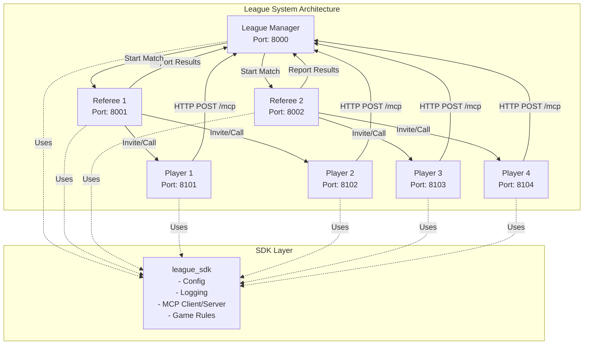
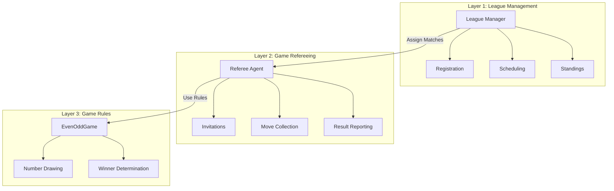
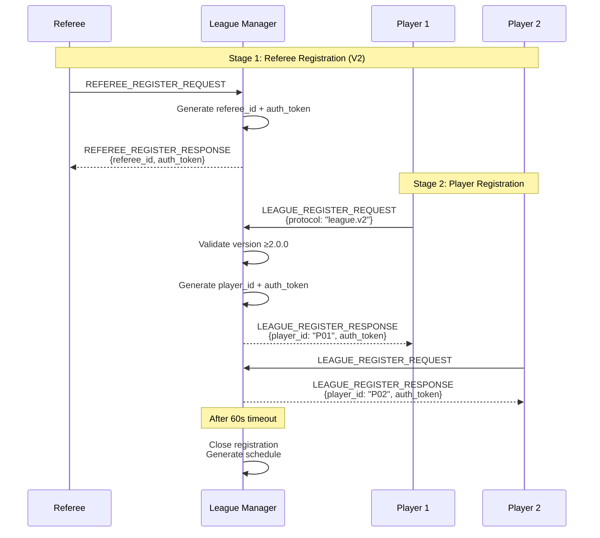
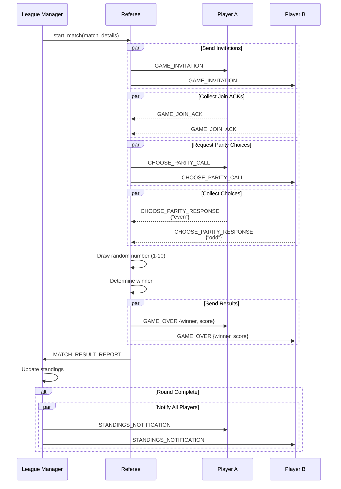
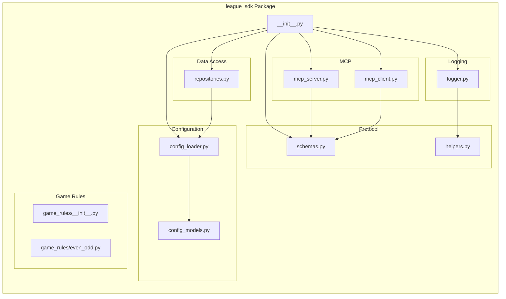
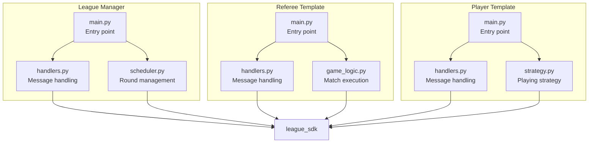
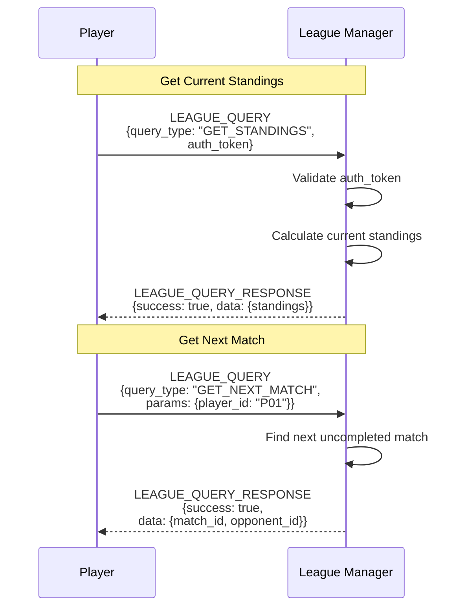

# Architecture Diagrams

## System Overview

## Three-Layer Architecture

## Registration Flow

## Match Execution Flow

## SDK Module Structure

## Agent Modular Structure

## Query Flow (LEAGUE_QUERY)

