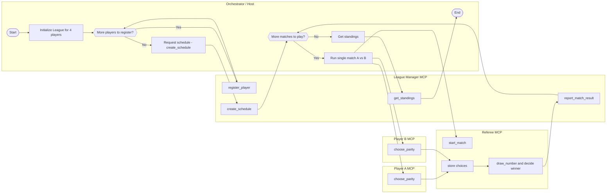

# Homework 07: Even or Odd League

**Dr. Yoram Segal**

© Dr. Yoram Segal - All Rights Reserved

December 2025

Version 1.0 - First Semester 5785

---

## Table of Contents

1. [Introduction: AI Agents and Game Leagues](#1-introduction-ai-agents-and-game-leagues)
2. [General League Protocol](#2-general-league-protocol)
3. [Even/Odd Game Implementation](#3-evenodd-game-implementation)
4. [Homework Requirements](#4-homework-requirements)
5. [Future Extensions](#5-future-extensions)
6. [Learning MCP Through the League Exercise](#6-learning-mcp-through-the-league-exercise)

---

## 1. Introduction: AI Agents and Game Leagues

### 1.1 What is an AI Agent?

In the world of artificial intelligence, the term "Agent" describes an autonomous software entity capable of making decisions and operating in a certain environment. Unlike traditional programs that operate according to a predefined script, an AI agent receives information from the environment, processes it, and chooses an action according to the goal defined for it.

Think about the difference between a regular car and an autonomous car: the regular car does exactly what the driver tells it, while the autonomous car receives information from many sensors, processes it, and decides on its own how to drive. The brain is the autonomous car's agent.

**Formal definition:** An AI agent is a system that receives observations from the environment, processes them using an internal model, and produces actions that affect the environment.

#### 1.1.1 Agent Components

Every agent is composed of three main components:

1. **Sensors**: Means for receiving information from the environment
2. **Decision-making model**: The logic that determines which action to perform
3. **Actuators**: Means for influencing the environment

**In the context of game leagues:**
- **Sensors**: JSON messages received from the referee (game state)
- **Decision model**: The algorithm that chooses the next move
- **Actuators**: JSON messages sent back to the referee (the chosen move)

### 1.2 What is a Game League?

A league is a competitive framework in which a number of participants compete against each other according to predefined rules. In our context, the league organizes competition between AI agents, where each agent is built by a different student.

#### 1.2.1 League Architectural Structure

The league is built from three separate layers:

**Table 1: League Architecture Layers**

| Layer | Role | Example |
|-------|------|---------|
| League Layer | Managing the overall competition | Player registration, schedule creation, ranking calculation |
| Referee Layer | Managing a single game | Starting game, validating moves, declaring winner |
| Game Layer | Specific game rules | Move legality checking, determining victory |

#### 1.2.2 Separation of Concerns

The central principle in this architecture is **separation of concerns**:

> **Important Principle:** The league layer and referee layer are **not dependent** on the specific game. You can replace the "Even/Odd" game with Tic-Tac-Toe, Chess, or any other game – **without changing the general protocol**.

The meaning: If you build an agent that speaks the "protocol language" correctly, it will be able to participate in any future league, regardless of the specific game.

### 1.3 MCP Protocol – A Common Language for Agents

#### 1.3.1 What is MCP?

Model Context Protocol (MCP) is a standard communication protocol for AI agents. It defines how agents communicate with each other through structured messages.

> **Analogy:** Think of MCP as the HTTP protocol for the internet. Just as HTTP defines how browsers and servers communicate, MCP defines how AI agents communicate.

#### 1.3.2 Communication Structure

In the system, each agent implements an MCP server that listens to requests:

```
# Each agent is an MCP server
# League Manager: http://localhost:8000/mcp
# Referee: http://localhost:8001/mcp
# Player 1: http://localhost:8101/mcp
# Player 2: http://localhost:8102/mcp

# Communication via HTTP POST with JSON-RPC 2.0
```

### 1.4 Two Stages of the Exercise

This exercise is divided into two stages:

#### 1.4.1 Stage 1: Private League

In this stage you will develop and test your agent locally:
- Run a local league on your computer
- Practice against simple agents (random or deterministic)
- Fix bugs and improve the strategy

#### 1.4.2 Stage 2: Class League

After your agent is ready:
- Submit the agent to the class's central league
- Your agent will compete against everyone (One vs. All)
- The grade will be determined by the position in the league table

> **Critical Warning:** If your agent does not speak the protocol language **exactly** as defined – it will be disqualified. There is no half-compatibility. There is no "almost correct". The protocol is a binding contract.

### 1.5 Learning Objectives

Upon completing this exercise, you will know:

1. Define and implement an independent AI agent
2. Understand and use a structured communication protocol (JSON schemas)
3. Apply the principle of separation of concerns in software architecture
4. Develop a strategy for a competitive game
5. Participate in a distributed system of agents

### 1.6 Chapter Summary

In this chapter we introduced the basic concepts:
- An AI agent is an autonomous software entity that receives information and performs actions
- A game league organizes competition between agents according to defined rules
- The architecture separates between league, refereeing, and game rules
- MCP is the protocol that enables standard communication between agents
- The exercise is divided into a local development stage and a class competition stage

In the next chapter we will dive deep into the general protocol and all the types of messages your agent must support.

---

## 2. General League Protocol

### 2.1 Protocol Principles

The protocol defines uniform rules. The rules enable different agents to communicate. Each student can implement an agent in any language they want. As long as the agent respects the protocol – it will participate in the league.

#### 2.1.1 Separation into Three Layers

The system is composed of three layers:

1. **League Layer** – Tournament management, player registration, schedule (Round-Robin), and ranking table.
2. **Referee Layer** – Single game management, move validation, declaring winner.
3. **Game Rules Layer** – Specific game logic (Even/Odd, Tic-Tac-Toe, etc.)

### 2.2 Agent Types

#### 2.2.1 League Manager

The league manager is a single agent. It is responsible for:
- Registering players to the league.
- Creating the game schedule (Round-Robin).
- Receiving results from referees.
- Calculating and publishing the ranking table.

The league manager operates as an MCP server on port **8000**.

#### 2.2.2 Referee

The referee manages a single game. It is responsible for:
- Inviting two players to a game.
- Managing game turns.
- Validating move legality.
- Announcing result and reporting to the league.

The referee operates as an MCP server on port **8001**.

#### 2.2.3 Player Agent

The player agent represents a player in the league. It is responsible for:
- Registering to the league.
- Receiving game invitations.
- Choosing moves in the game.
- Updating internal state according to results.

Each player operates on a separate port (8101–8104).

### 2.3 Protocol Identifiers

Each component in the system is uniquely identified.

**Table 2: Identifiers in the League Protocol**

| Identifier Name | Type | Description |
|-----------------|------|-------------|
| league_id | String | Unique league identifier |
| round_id | Integer | Round number in the league |
| match_id | String | Single match identifier |
| game_type | String | Game type |
| player_id | String | Player identifier |
| conversation_id | String | Conversation identifier |

#### 2.3.1 Identifier Examples

- **league_id:** "league_2025_even_odd"
- **round_id:** 1, 2, 3, ...
- **match_id:** "R1M1" (Round 1, Match 1)
- **game_type:** "even_odd" or "tic_tac_toe"
- **player_id:** "P01", "P02", ..., "P20"

### 2.4 General Message Structure

Every message in the protocol contains fixed fields.

```json
{
  "protocol": "league.v1",
  "message_type": "...",
  "league_id": "...",
  "round_id": 1,
  "match_id": "R1M3",
  "conversation_id": "uuid-or-similar",
  "sender": "league_manager | referee | player:P01",
  "timestamp": "ISO-8601"
}
```

#### 2.4.1 Field Explanations

- **protocol** – Fixed, protocol version "league.v1".
- **message_type** – Message type (registration, invitation, move, etc.).
- **league_id** – Current league identifier.
- **round_id** – Round number.
- **match_id** – Match identifier.
- **conversation_id** – Conversation identifier.
- **sender** – Who sent the message.
- **timestamp** – Timestamp in ISO-8601 format.

### 2.5 General League Flow

#### 2.5.1 Stage 1: Player Registration

Initially, each player registers to the league. The player sends a registration request to the league manager. The league manager assigns a player_id and confirms.

```
Player Agent                    League Manager
    |                                |
    |----REGISTER_REQUEST---------->|
    |                                |
    |<---REGISTER_RESPONSE----------|
    |                                |
```

#### 2.5.2 Stage 2: Creating Game Schedule

After all players have registered, the league manager creates a game schedule. The schedule is based on the Round-Robin method. Each player plays one game against each other player.

#### 2.5.3 Stage 3: Round Announcement

Before each round, the league manager publishes a ROUND_ANNOUNCEMENT message. The message details all games in the round.

#### 2.5.4 Stage 4: Managing Games

The referee invites players to a game. It manages the game according to game rules. At the end, it reports the result to the league manager.

#### 2.5.5 Stage 5: Ranking Update

After each round, the league manager updates the ranking table. It publishes the table to all players.

### 2.6 General Flow Diagram

```
                    Start
                      │
                      ▼
              Register Players
                      │
                      ▼
              Create Schedule
                      │
                      ▼
               ┌─────────────┐
          ┌───▶│    More     │
          │    │  Matches?   │
          │    └──────┬──────┘
          │           │
          │     Yes   │   No
          │     ┌─────┴─────┐
          │     │           │
          │     ▼           ▼
          │ Run Match   Update Standings
          │     │           │
          └─────┘           ▼
                          End
```

### 2.7 Important Principles

#### 2.7.1 Single Source of Truth

The referee is the source of truth for game state. Players do not maintain their own state. They rely on the information the referee sends.

#### 2.7.2 Communication Through Orchestrator

Players do not speak directly with each other. All communication passes through the referee or league manager. This ensures the protocol is maintained.

#### 2.7.3 Response Times

Each request has a maximum response time. If a player doesn't respond in time – they technically lose. The default is **30 seconds**.

#### 2.7.4 Error Handling

If a player sends an illegal move:
1. The referee sends a MOVE_REJECTED message.
2. The player gets another chance.
3. After **3** failed attempts – technical loss.

---

## 3. Even/Odd Game Implementation

### 3.1 Game Description

The "Even/Odd" game is surprisingly simple but enables learning important principles in agent programming. The game represents a minimal variation of a league, thus allowing focus on the protocol and architecture.

#### 3.1.1 Game Rules

1. Two players participate in a game
2. Each player chooses "even" or "odd" – simultaneously, without knowing the opponent's choice
3. The referee draws a natural number between 1 and 10
4. If the number is even – the player who chose "even" wins
5. If the number is odd – the player who chose "odd" wins
6. If both chose the same thing and were right – tie
7. If both chose the same thing and were wrong – tie

> **Note:** Both players choose **simultaneously**. There is no advantage to the first player. If both chose the same option – the result is a **tie** (whether both were right or both were wrong).

#### 3.1.2 Practical Example

Let's assume a game between player A and player B:

**Table 3: Even/Odd Game Example**

| Choice A | Choice B | Drawn Number | Result |
|----------|----------|--------------|--------|
| even | odd | 6 (even) | Player A wins |
| even | odd | 3 (odd) | Player B wins |
| even | even | 8 (even) | Tie (both right) |
| odd | odd | 4 (even) | Tie (both wrong) |

### 3.2 League Structure

#### 3.2.1 Round-Robin Format

In a league of 4 players, each pair of players meets (once or more, by definition). In total there are:

$$\binom{4}{2} = \frac{4!}{2!(4-2)!} = 6 \text{ games}$$

**Table 4: Sample Match Schedule**

| Round | Player A | Player B | Match ID |
|-------|----------|----------|----------|
| 1 | P01 | P02 | R1M1 |
| 1 | P03 | P04 | R1M2 |
| 2 | P01 | P03 | R2M1 |
| 2 | P02 | P04 | R2M2 |
| 3 | P01 | P04 | R3M1 |
| 3 | P02 | P03 | R3M2 |

#### 3.2.2 Point Calculation

- **Win:** 3 points
- **Tie:** 1 point for each player (when both chose the same thing)
- **Loss:** 0 points

**When is there a tie?** A tie occurs when **both players chose the same option** – whether both were right or both were wrong. For example: both chose "even" and the drawn number is even – tie, both were right. Or: both chose "even" and the number is odd – tie, both were wrong.

### 3.3 Local System Architecture

#### 3.3.1 MCP Servers – Port Allocation

```
# League Manager - Central coordination
League Manager: http://localhost:8000/mcp

# Referee - Game management
Referee: http://localhost:8001/mcp

# Players - Your agents
Player 1: http://localhost:8101/mcp
Player 2: http://localhost:8102/mcp
Player 3: http://localhost:8103/mcp
Player 4: http://localhost:8104/mcp
```

#### 3.3.2 Role of the Orchestrator

The Orchestrator (or Host) is the component that connects all agents:
- Sends HTTP POST requests to each MCP server
- Manages the routing: when the referee needs to speak with a player, the Host executes the call
- Can be a simple script or an LLM itself

### 3.4 Agent Functions (Tools)

#### 3.4.1 League Agent Functions

```python
def register_player(player_meta) -> player_id:
    """
    Registers a new player to the league.
    Returns: Unique player ID (e.g., "P01")
    """
    pass

def create_schedule(players) -> list[matches]:
    """
    Creates round-robin schedule for all players.
    Returns: List of match definitions
    """
    pass

def report_match_result(match_id, winner_player_id) -> status:
    """
    Records match result and updates standings.
    Returns: "ok" on success
    """
    pass

def get_standings() -> standings_table:
    """
    Returns current league standings.
    Returns: List of players with wins/losses/points
    """
    pass
```

#### 3.4.2 Referee Agent Functions

```python
def start_match(match_info) -> game_session_id:
    """
    Initializes a match between two players.
    Input: player_A_id, player_B_id, endpoints
    Returns: Unique game session ID
    """
    pass

def collect_choices(game_session_id) -> game_state:
    """
    Requests parity choice from each player.
    Uses orchestrator to call players' choose_parity()
    Returns: Updated game state with choices
    """
    pass

def draw_number(game_session_id) -> game_state:
    """
    Draws random number 1-10, determines winner.
    Returns: Final game state with result
    """
    pass

def finalize_match(game_session_id) -> result:
    """
    Reports result to League Manager.
    Returns: {winner_player_id, number, choices}
    """
    pass
```

#### 3.4.3 Player Agent Functions – What You Need to Implement

```python
def handle_game_invitation(params) -> dict:
    """
    Called when referee sends GAME_INVITATION.
    Must respond within 5 seconds!
    
    Input: match_id, game_type, opponent_id
    Returns: GAME_JOIN_ACK message
    """
    return {
        "message_type": "GAME_JOIN_ACK",
        "match_id": params.get("match_id"),
        "player_id": self.player_id,
        "arrival_timestamp": datetime.now().isoformat() + "Z",
        "accept": True
    }

def choose_parity(context) -> str:
    """
    YOUR MAIN IMPLEMENTATION!
    Called when referee sends CHOOSE_PARITY_CALL.
    Must respond within 30 seconds!
    
    Input context includes:
    - opponent_id: Who you're playing against
    - league_standings: Current standings
    - history: Previous games (optional)
    
    Returns: "even" or "odd"
    
    Strategy options:
    1. Random: random.choice(["even", "odd"])
    2. Deterministic: Always "even" or "odd"
    3. LLM-based: Build prompt, ask LLM
    4. Pattern-based: Analyze history
    """
    pass

def notify_match_result(result) -> ack:
    """
    Called by referee after match ends (GAME_OVER).
    Use this to update internal history/strategy.
    
    Input: winner, drawn_number, choices
    Returns: Acknowledgment
    """
    pass
```

**The Central Function:** The `choose_parity` function is the heart of your agent. All your strategy is expressed in it. This is the only function that really affects the results.

### 3.5 Complete Game Flow

#### 3.5.1 Flow Diagram

1. **Initialization:** The Orchestrator registers 4 players with League Manager
2. **Schedule Creation:** League Manager creates a schedule of 6 games
3. **For each game:**
   - (a) Orchestrator calls `Referee.start_match`
   - (b) Referee sends invitations to both players
   - (c) Referee calls `choose_parity` of each player (through the Orchestrator)
   - (d) Referee draws a number, determines winner
   - (e) Referee calls `League Manager.report_match_result`
4. **End:** League Manager returns `get_standings`

#### 3.5.2 Example Code for Game Flow

```python
# Simplified match flow (pseudocode)

# 1. Start match
session_id = referee.start_match({
    "match_id": "R1M1",
    "player_A_id": "P01",
    "player_B_id": "P02"
})

# 2. Collect choices (parallel, through orchestrator)
choice_A = player_A.choose_parity(context)  # "even" or "odd"
choice_B = player_B.choose_parity(context)  # "even" or "odd"

# 3. Draw number and determine winner
number = random.randint(1, 10)
parity = "even" if number % 2 == 0 else "odd"

# Determine result based on choices
A_correct = (choice_A == parity)
B_correct = (choice_B == parity)

if A_correct and not B_correct:
    winner = "P01"  # Only A guessed correctly
elif B_correct and not A_correct:
    winner = "P02"  # Only B guessed correctly
else:
    winner = None   # TIE: both correct or both wrong

# 4. Report result
league_manager.report_match_result("R1M1", winner)
```

### 3.6 Possible Strategies

#### 3.6.1 Strategy 1: Random

```python
import random

def choose_parity(context):
    return random.choice(["even", "odd"])
```

**Advantage:** Simple, unpredictable  
**Disadvantage:** 50% chance per game without improvement

#### 3.6.2 Strategy 2: Deterministic

```python
def choose_parity(context):
    return "even"  # Always choose even
```

**Advantage:** Simplest  
**Disadvantage:** Completely predictable (although it doesn't matter in this game)

#### 3.6.3 Strategy 3: LLM-Guided

```python
import openai  # or anthropic, etc.

def choose_parity(context):
    prompt = f"""
    You are playing an Even/Odd game.
    Opponent: {context['opponent_id']}
    Current standings: {context['standings']}
    Previous results: {context.get('history', [])}
    
    Choose "even" or "odd" to maximize winning.
    Reply with only the word "even" or "odd".
    """
    
    response = openai.chat.completions.create(
        model="gpt-4",
        messages=[{"role": "user", "content": prompt}]
    )
    
    choice = response.choices[0].message.content.strip().lower()
    return choice if choice in ["even", "odd"] else "even"
```

**Advantage:** Flexible, can "learn" patterns  
**Disadvantage:** More complex, depends on external API

#### 3.6.4 Strategy 4: History-Based

```python
class HistoryBasedAgent:
    def __init__(self):
        self.history = []
    
    def choose_parity(self, context):
        if not self.history:
            return random.choice(["even", "odd"])
        
        # Count recent outcomes
        even_wins = sum(1 for h in self.history[-5:]
                       if h['parity'] == 'even')
        odd_wins = 5 - even_wins
        
        # Choose based on recent bias
        if even_wins > odd_wins:
            return "even"
        elif odd_wins > even_wins:
            return "odd"
        else:
            return random.choice(["even", "odd"])
    
    def notify_match_result(self, result):
        self.history.append({
            'number': result['drawn_number'],
            'parity': 'even' if result['drawn_number'] % 2 == 0 else 'odd'
        })
```

**Important Note on Strategies:** Since the draw is truly random, there is no "better" strategy from a mathematical standpoint. Any strategy will settle at about 50% success over time. However, the goal of the exercise is to learn the architecture and protocol, not to win.

### 3.7 LLM Integration in the System

#### 3.7.1 Role of the LLM

An LLM can be integrated in two places:
1. **As the player's "brain":** As we saw in strategy 3
2. **As the Orchestrator:** The LLM itself manages the league

#### 3.7.2 LLM-Guided Player Architecture

```python
class LLMPlayer:
    def __init__(self, llm_client):
        self.llm = llm_client
        self.history = []
    
    def choose_parity(self, context):
        # Build context-aware prompt
        prompt = self._build_prompt(context)
        
        # Get LLM response
        response = self.llm.complete(prompt)
        
        # Parse and validate
        choice = self._parse_response(response)
        return choice
    
    def _build_prompt(self, context):
        return f"""
        Game: Even/Odd League
        Your ID: {context['my_id']}
        Opponent: {context['opponent_id']}
        
        History of last 5 games:
        {self._format_history()}
        
        Current standings:
        {context['standings']}
        
        What do you choose? Reply "even" or "odd".
        """
    
    def _parse_response(self, response):
        text = response.strip().lower()
        if "even" in text:
            return "even"
        return "odd"
```

### 3.8 Chapter Summary

In this chapter we learned:
- Even/Odd game rules – simple but enable learning
- Round-Robin league structure with 4 players
- Port allocation for different MCP servers
- Functions (Tools) for each agent type
- Complete game flow from start to finish
- Four possible implementation strategies
- LLM integration as the agent's "brain"

In the next chapter we will detail the exact exercise requirements and evaluation criteria.

---

## 4. Homework Requirements

### 4.1 Task Overview

In this exercise you will develop an AI agent that participates in an "Even/Odd" game league. Your agent must speak the protocol language we learned in the previous chapters.

#### 4.1.1 What to Submit

1. **Source code file:** `player_agent.py` – your agent
2. **Documentation file:** `README.md` – brief explanation of the strategy
3. **Configuration file:** `config.json` – connection details (if relevant)

### 4.2 Mandatory Technical Requirements

#### 4.2.1 Protocol Requirements

**Critical requirements – without compliance the agent will be disqualified:**

1. Agent must support protocol `league.v1`
2. Every message must include all required fields
3. Agent must respond in standard JSON format
4. The `game_types` field must include `"even_odd"`

#### 4.2.2 Response Time Requirements

**Table 5: Maximum Response Times**

| Message | Maximum Time | Required Response |
|---------|--------------|-------------------|
| GAME_INVITATION | 5 seconds | GAME_JOIN_ACK |
| CHOOSE_PARITY_CALL | 30 seconds | CHOOSE_PARITY_RESPONSE |

**Penalty for Exceeding Times:** If the agent doesn't respond in time, it loses the game as a **technical loss** and receives **0** points.

#### 4.2.3 Code Structure Requirements

Your agent must implement the following interface:

```python
class PlayerAgent:
    """
    Required interface for your agent.
    """
    
    def __init__(self, player_id: str, config: dict = None):
        """
        Initialize the agent.
        
        Args:
            player_id: Your assigned player ID (e.g., "P01")
            config: Optional configuration dictionary
        """
        pass
    
    def handle_message(self, message: dict) -> dict:
        """
        Main message handler. MUST handle all protocol messages.
        
        Args:
            message: Incoming JSON message
        
        Returns:
            Response message as dict, or None if no response needed
        """
        pass
    
    def choose_parity(self, context: dict) -> str:
        """
        Your strategy implementation.
        
        Args:
            context: Game context (opponent, standings, etc.)
        
        Returns:
            "even" or "odd"
        """
        pass
```

### 4.3 Private League Guidelines

#### 4.3.1 Development Environment

Before submitting the agent to the class league, you must test it in a local environment.

```bash
# 1. Clone the league framework
git clone https://github.com/course/even-odd-league.git

# 2. Install dependencies
pip install -r requirements.txt

# 3. Run local league with your agent
python run_local_league.py --players your_agent.py dummy_agent.py
```

#### 4.3.2 Available Test Agents

The library includes simple agents for testing:

**Table 6: Available Test Agents**

| Agent | Behavior | Recommended Use |
|-------|----------|-----------------|
| always_even.py | Always chooses even | Basic protocol testing |
| always_odd.py | Always chooses odd | Basic protocol testing |
| random_agent.py | Random choice | General performance testing |
| slow_agent.py | Delays responses | Testing handling of delays |

#### 4.3.3 Checklist

Before submission, ensure your agent passes all tests:

- [ ] Agent starts without errors
- [ ] Agent responds to GAME_INVITATION with GAME_JOIN_ACK within 5 seconds
- [ ] Agent responds to CHOOSE_PARITY_CALL with CHOOSE_PARITY_RESPONSE within 30 seconds
- [ ] The parity_choice field contains only "even" or "odd"
- [ ] Agent doesn't crash when receiving GAME_OVER
- [ ] Agent meets all response times
- [ ] Agent completes a full league of 6 games without crashing

### 4.4 Submission to Class League

#### 4.4.1 Submission Process

1. Enter the course submission system
2. Upload the agent files (player_agent.py, README.md)
3. The system will run automatic tests
4. If all tests pass – the agent will be registered to the league
5. The league will take place on the defined day and time

#### 4.4.2 League Structure

- **Expected number of participants:** 20-30 agents
- **Format:** Full Round-Robin (each against each)
- **Number of games per pair:** 3
- **Total expected games:** Hundreds of games

### 4.5 Evaluation Criteria

#### 4.5.1 Grade Distribution

**Table 7: Grading Criteria**

| Criterion | Weight | Details |
|-----------|--------|---------|
| Protocol Compliance | 40% | Agent meets all protocol requirements |
| Stability and Reliability | 20% | Agent completes games without crashes |
| Documentation | 20% | Clear and comprehensive documentation of strategy |
| League Results | 20% | Position in league table |

**Note on League Grade:** Since the game is a random draw, the league grade gives a bonus but is not decisive. An agent that works correctly but loses draws will not be penalized in the final grade.

#### 4.5.2 Common Reasons for Grade Reduction

Errors that will cause significant grade reduction:

1. Agent fails to register to the league
2. Agent crashes mid-game
3. Agent sends non-standard JSON
4. Agent doesn't meet response times
5. parity_choice field contains a value that is not "even" or "odd"

### 4.6 Frequently Asked Questions

#### 4.6.1 Is it Allowed to Use an LLM?

**Yes.** It is allowed and even recommended to try. But note:
- You are responsible for API costs
- Make sure the agent works even if the API is slow
- Must meet response times even with LLM call

#### 4.6.2 Is it Allowed to Share Code with Friends?

**No.** Each student must develop an independent agent. Code sharing is considered copying.

#### 4.6.3 What Happens if My Agent Crashes Mid-League?

- Every incomplete game counts as a technical loss
- The agent stays in the league but receives 0 points for games it didn't complete
- Therefore: **Test well before submission!**

#### 4.6.4 Is it Possible to Improve the Agent After Submission?

- **Until the league deadline:** Yes, can submit an updated version
- **After the league:** No, results are final

### 4.7 Skeleton Code for Getting Started

```python
"""
Even/Odd League Player Agent
Student: [YOUR NAME]
ID: [YOUR ID]
"""

import random
from datetime import datetime

class PlayerAgent:
    def __init__(self, player_id: str, config: dict = None):
        self.player_id = player_id
        self.config = config or {}
        self.history = []
    
    def handle_message(self, message: dict) -> dict:
        """Route messages to appropriate handlers."""
        msg_type = message.get("message_type")
        
        handlers = {
            "GAME_INVITATION": self._handle_invitation,
            "CHOOSE_PARITY_CALL": self._handle_parity_call,
            "GAME_OVER": self._handle_game_over,
            "LEAGUE_STANDINGS_UPDATE": self._handle_standings,
        }
        
        handler = handlers.get(msg_type)
        if handler:
            return handler(message)
        return None
    
    def _handle_invitation(self, msg: dict) -> dict:
        # Must respond within 5 seconds!
        return {
            "message_type": "GAME_JOIN_ACK",
            "match_id": msg.get("match_id"),
            "player_id": self.player_id,
            "arrival_timestamp": datetime.now().isoformat() + "Z",
            "accept": True
        }
    
    def _handle_parity_call(self, msg: dict) -> dict:
        # Must respond within 30 seconds!
        context = msg.get("context", {})
        choice = self.choose_parity(context)
        return {
            "message_type": "CHOOSE_PARITY_RESPONSE",
            "match_id": msg.get("match_id"),
            "player_id": self.player_id,
            "parity_choice": choice
        }
    
    def _handle_game_over(self, msg: dict) -> dict:
        # Update history for future strategy
        self.history.append(msg)
        return {"message_type": "ACK"}
    
    def _handle_standings(self, msg: dict) -> dict:
        # Optional: use standings for strategy
        return None
    
    def choose_parity(self, context: dict) -> str:
        """
        YOUR STRATEGY GOES HERE!
        Currently: random choice
        """
        return random.choice(["even", "odd"])
```

### 4.8 Schedule

**Table 8: Assignment Timeline**

| Date | Activity | Notes |
|------|----------|-------|
| Week 1 | Exercise Opening | Publication of this document |
| Week 2 | Last Date for Questions | Must ask questions before |
| Week 3 | Final Submission Deadline | At night 23:59 |
| Week 4 | League Run | At the announced time |
| Week 5 | Results Publication | Final table + grades |

### 4.9 Chapter Summary

In this chapter we detailed all the exercise requirements:
- **What to submit:** Agent code, documentation, configuration file
- **Technical requirements:** Protocol compliance, response times, code structure
- **Private league:** Development environment, test agents, checklist
- **Submission to class:** Submission process, league structure
- **Evaluation:** Criteria, grade distribution, common errors
- **Skeleton code:** Starting point for development

In the next chapter we will discuss future outlook – how the protocol we learned enables more complex games.

---

## 5. Future Extensions

### 5.1 The Protocol as Infrastructure for Any Game

The protocol we learned in this exercise is not specific to the "Even/Odd" game. It was deliberately designed as a **general communication layer** that enables adding new games without changing the architecture.

#### 5.1.1 The Separation Principle

**Key Principle:** The league layer and referee layer remain **completely identical** even when changing games. Only the "game rules module" changes.

**To replace a game, you only need to change:**
1. The `game_type` field in messages
2. The `game_state` structure
3. The `proposed_move` structure
4. The referee's internal module that validates moves

### 5.2 Possible Future Games

#### 5.2.1 Tic-Tac-Toe

The classic game on a 3×3 board:

**game_state structure for Tic-Tac-Toe:**

```json
{
  "game_type": "tic_tac_toe",
  "board": [
    ["X", " ", "O"],
    [" ", "X", " "],
    ["O", " ", " "]
  ],
  "current_symbol": "X",
  "legal_moves": [
    {"row": 0, "col": 1},
    {"row": 1, "col": 0},
    {"row": 1, "col": 2},
    {"row": 2, "col": 1},
    {"row": 2, "col": 2}
  ],
  "move_number": 5
}
```

**proposed_move structure for Tic-Tac-Toe:**

```json
{
  "message_type": "PLAYER_MOVE_PROPOSAL",
  "proposed_move": {
    "action_type": "PLACE_SYMBOL",
    "position": {
      "row": 1,
      "col": 0
    }
  }
}
```

#### 5.2.2 21 Questions Game

A thinking game where one player thinks of something and the other tries to guess it in 21 questions:

**game_state structure for 21 Questions:**

```json
{
  "game_type": "21_questions",
  "role": "guesser",
  "questions_remaining": 15,
  "asked_questions": [
    {"question": "Is it alive?", "answer": "no"},
    {"question": "Is it bigger than a car?", "answer": "yes"}
  ],
  "current_phase": "ASK_QUESTION"
}
```

#### 5.2.3 Number Guessing Game

A game where one player chooses a number and the other tries to guess:

**game_state structure for Number Guessing:**

```json
{
  "game_type": "number_guessing",
  "range": {"min": 1, "max": 100},
  "guesses_remaining": 7,
  "history": [
    {"guess": 50, "feedback": "too_high"},
    {"guess": 25, "feedback": "too_low"}
  ]
}
```

### 5.3 Internal Interface of the Game Module

#### 5.3.1 Required Functions

Every game module must implement the following interface (internal to the referee):

```python
class GameModule:
    """
    Interface every game module must implement.
    """
    
    def init_game_state(self) -> dict:
        """
        Create initial game state.
        Returns: Initial game_state dictionary
        """
        pass
    
    def validate_move(self, game_state: dict,
                      player_id: str,
                      move: dict) -> tuple[bool, str]:
        """
        Check if move is legal.
        Returns:
            (True, None) if valid
            (False, error_message) if invalid
        """
        pass
    
    def apply_move(self, game_state: dict,
                   move: dict) -> dict:
        """
        Apply move and return new state.
        Returns: Updated game_state
        """
        pass
    
    def check_game_status(self, game_state: dict) -> dict:
        """
        Check if game ended.
        Returns: {
            "status": "ONGOING" | "WIN" | "DRAW",
            "winner": player_id or None
        }
        """
        pass
```

#### 5.3.2 Example: Even/Odd Module

```python
import random

class EvenOddModule:
    def init_game_state(self):
        return {
            "game_type": "even_odd",
            "P1_choice": None,
            "P2_choice": None,
            "drawn_number": None,
            "current_phase": "COLLECT_CHOICES"
        }
    
    def validate_move(self, state, player_id, move):
        choice = move.get("parity_choice")
        if choice not in ["even", "odd"]:
            return False, "Must be 'even' or 'odd'"
        return True, None
    
    def apply_move(self, state, move):
        # Store choice (simplified)
        state["last_choice"] = move["parity_choice"]
        return state
    
    def check_game_status(self, state):
        if state["P1_choice"] and state["P2_choice"]:
            # Both chose, draw number
            number = random.randint(1, 10)
            parity = "even" if number % 2 == 0 else "odd"
            
            P1_correct = (state["P1_choice"] == parity)
            P2_correct = (state["P2_choice"] == parity)
            
            if P1_correct and not P2_correct:
                return {"status": "WIN", "winner": "P1"}
            elif P2_correct and not P1_correct:
                return {"status": "WIN", "winner": "P2"}
            else:
                # Both correct or both wrong = TIE
                return {"status": "DRAW", "winner": None}
        
        return {"status": "ONGOING", "winner": None}
```

### 5.4 Advantages of Modular Architecture

#### 5.4.1 Easy Game Addition

A developer who wants to add a new game only needs to:
1. Write a new game module (the four functions)
2. Define a new value for `game_type`
3. Define the `game_state` and `proposed_move` structures

**No need to change:**
- The league code
- The general protocol
- The existing agents (just add support)

#### 5.4.2 Backward Compatibility

An agent that only supports `even_odd` – will simply not register for games it doesn't support. It can continue to work even when there are additional games in the league.

#### 5.4.3 Automatic Testing

Since the interface is uniform, you can write generic tests that work for any game:

```python
def test_game_module(module):
    """Generic test for any game module."""
    # Test initialization
    state = module.init_game_state()
    assert state is not None
    
    # Test status check
    status = module.check_game_status(state)
    assert status["status"] in ["ONGOING", "WIN", "DRAW"]
    
    # Test that game eventually ends
    # (would need game-specific moves)
    
    print(f"Module {module.__class__.__name__} passed!")
```

### 5.5 Advanced Challenges

#### 5.5.1 Learning Agents

In future exercises you will be able to develop agents that learn and improve:
- **Reinforcement Learning** – An agent that learns from experience
- **Monte Carlo Tree Search** – For games like Tic-Tac-Toe (possibility search)
- **Neural Networks** – A neural network that learns to play

#### 5.5.2 Distributed Leagues

The architecture also enables:
- Running games between agents on different computers
- Leagues between universities
- International competitions

#### 5.5.3 Integration with Advanced LLMs

```python
class AdvancedLLMAgent:
    def __init__(self, llm_client):
        self.llm = llm_client
        self.long_term_memory = []  # Cross-game learning
        self.opponent_profiles = {}  # Model opponents
    
    def choose_parity(self, context):
        opponent = context["opponent_id"]
        
        # Build opponent profile
        profile = self.opponent_profiles.get(opponent, {})
        
        prompt = f"""
        You are playing Even/Odd against {opponent}.
        
        Opponent profile:
        {json.dumps(profile, indent=2)}
        
        Your overall win rate: {self._calc_win_rate()}
        
        Based on patterns, what do you choose?
        """
        
        response = self.llm.complete(prompt)
        return self._parse(response)
    
    def update_profile(self, opponent, result):
        """Learn from each game."""
        if opponent not in self.opponent_profiles:
            self.opponent_profiles[opponent] = {
                "games": 0,
                "their_choices": {"even": 0, "odd": 0}
            }
        
        profile = self.opponent_profiles[opponent]
        profile["games"] += 1
        profile["their_choices"][result["opponent_choice"]] += 1
```

### 5.6 Course Summary

#### 5.6.1 What We Learned

In this exercise you learned:
1. **AI Agent Principles:** Autonomous entities that receive information and make decisions
2. **Communication Protocol:** A common language between agents (MCP)
3. **Modular Architecture:** Separation between league, refereeing, and game rules
4. **Message-Driven Programming:** Responding to incoming messages
5. **Working with JSON:** Standard data format

#### 5.6.2 Skills You Acquired

- Distributed software development
- Working with defined protocols
- Strategy planning for games
- Software compatibility testing
- Code documentation

#### 5.6.3 Where We Go From Here

The knowledge you acquired in this exercise is a foundation for:
- Developing more complex agents
- Working with Multi-Agent systems
- Integrating LLMs in autonomous processes
- Developing AI games and competitions

**Closing Message:** The protocol you learned is the "language" that AI agents speak. Just as a programming language allows you to communicate with a computer, a protocol like MCP enables different agents to communicate with each other – agents that cooperate and compete, each with their own unique capabilities. This is the future of artificial intelligence.

### 5.7 Appendix: Complete Flow Diagram

Below is the complete flow diagram of the league (can be used as a reference tool):



**Good luck with the exercise!**

---

## 6. Learning MCP Through the League Exercise

The Even/Odd League exercise is not just a programming exercise. It represents a complete pedagogical model for understanding the MCP protocol and AI agent principles. In this chapter we will explain how the exercise teaches the fundamental principles of AI agents and MCP protocol.

### 6.1 The Player as an AI Agent

#### 6.1.1 Is the Player Agent an AI Agent?

The first question to ask is: Is the Player Agent in the league really an AI agent? The answer is unambiguous: **Yes.**

An AI agent is defined as an entity that interacts with the environment to achieve defined goals [1]. Unlike a regular program that executes predetermined instructions, an AI agent is autonomous software that receives information from the environment, processes it, and decides on its own what to perform based on the current situation.

#### 6.1.2 The Four Characteristics of an AI Agent

Let's examine the player agent in the league in light of the four main characteristics of an AI agent:

1. **Autonomy** – The agent operates independently. In the game context, the player agent decides autonomously which strategy to choose: "even" or "odd". No one tells it what to choose.

2. **Perception** – The agent receives information from the environment. The player receives game invitation messages (GAME_INVITATION), parity choice requests (CHOOSE_PARITY_CALL), and game results (GAME_OVER) from the referee and league manager.

3. **Action** – The agent influences the environment. The player performs actions by sending arrival confirmations (GAME_JOIN_ACK) and choices (CHOOSE_PARITY_RESPONSE) to games.

4. **Goal-Orientation** – The agent has a defined goal. Its goal is to play, win games, and update its internal state such as win/loss history.

The player agent can even use a Large Language Model (LLM) to choose the best strategy. By doing so it demonstrates "reasoning" or "thinking" before executing the action.

### 6.2 The Player in MCP Architecture

#### 6.2.1 Client or Server?

In the Even/Odd league architecture, the player is primarily an **MCP server**.

An MCP server is a component that exposes services and capabilities, called "Tools", "Resources", or "Prompts". The server is defined as a separate process that operates on a defined port and provides a "gateway" to the outside world [2].

The player agent is required to implement an HTTP server that receives POST requests on the /mcp path. The tools it exposes are called through the JSON-RPC 2.0 protocol. The tools the player must implement include:
- `handle_game_invitation` – Handling game invitations.
- `choose_parity` – Choosing "even" or "odd".
- `notify_match_result` – Receiving notification about game result.

#### 6.2.2 Relationships with the Referee and League Manager

Given that the player is a server, whoever calls its services is the client. In the league system, the referee and league manager act as clients or orchestrators.

The referee's `collect_choices` tool is what creates the JSON-RPC request for CHOOSE_PARITY_CALL. When the referee wants to collect choices from players, it sends a request to each player.

**In summary:** Although the player agent is an autonomous AI agent, from the perspective of MCP protocol implementation, it fulfills the role of a server that exposes capabilities to the central orchestrators.

### 6.3 The Referee and League Manager as AI Agents

#### 6.3.1 High-Level Agents

The referee and league manager are also defined as AI agents. They possess all four of the same characteristics:

**Table 9: AI Agent Characteristics for Referee and League Manager**

| Characteristic | League Manager | Referee |
|----------------|----------------|---------|
| Goal-Orientation | Managing the entire league, creating game schedule, calculating ranking | Managing single game, validating move legality, determining winner |
| Autonomy | Operates independently for determining game rounds | Manages game stages: invitation, choice collection, drawing |
| Perception | Receives registration requests from players, result reports from referees | Receives arrival confirmations, parity choices from players |
| Action | Sends round announcements, updates ranking tables | Sends game invitations, choice requests, reports results |

These agents are not passive. They manage the entire system according to rules and goals. This is the essence of autonomy and goal-orientation of an AI agent.

#### 6.3.2 MCP Servers That Also Act as Clients

Both of these agents are defined as MCP servers:
- The league manager operates as an MCP server on port 8000. It implements tools like `register_player` and `report_match_result`.
- The referee operates as an MCP server on port 8001. It implements tools like `start_match` and `collect_choices`.

**Important Note:** The referee and league manager, although defined as servers, must also act as **MCP clients** to fulfill their central role. For example:
- The referee must act as a client to call the player agent's `choose_parity` tool.
- The league manager must act as a client to send round announcements to player agents.

In this system, the central servers are actually orchestrators-clients that need to activate actions at player servers.

### 6.4 Central Insight: Role Reversal

#### 6.4.1 The Traditional Paradigm

In typical client-server architecture, the client is the active component that sends requests, and the server is the passive component that waits for requests.

#### 6.4.2 Role Reversal in the League

In the AI league, there is a creative role reversal:

**The player (the autonomous agent) is the server:** Although the player is the autonomous entity that needs to perform action, it is required to expose its capabilities as an MCP server.

**The referee and league manager (the orchestrators) are the clients:** The referee is the orchestrator that acts as an MCP client and calls `choose_parity` to the player to drive the next step in the game.

```
┌─────────────────────┐          ┌─────────────────────┐
│      Player 1       │          │      Player 2       │
│    (MCP Server)     │          │    (MCP Server)     │
│       :8101         │          │       :8102         │
└──────────┬──────────┘          └──────────┬──────────┘
           ▲                                ▲
           │ choose_parity                  │ choose_parity
           │                                │
           └───────────────┬────────────────┘
                           │
         ┌─────────────────┴───────────────────┐
         │       Referee (Orchestrator)        │
         │        Acts as MCP Client           │
         │              :8001                  │
         └──────────────────┬──────────────────┘
                            ▲
                            │ ROUND_ANNOUNCEMENT
                            │
         ┌──────────────────┴──────────────────┐
         │          League Manager             │
         │        Acts as MCP Client           │
         │              :8000                  │
         └─────────────────────────────────────┘
```

### 6.5 Layer Separation Principle

#### 6.5.1 Three Separate Layers

The MCP protocol enables clear separation between roles:

1. **League Layer** (managed by League Manager) – Player recruitment, game schedule (Round-Robin), and ranking table.
2. **Referee Layer** (managed by Referee) – Single game management and move validation.
3. **Game Rules Layer** (managed by separate module) – Specific game logic for Even/Odd.

#### 6.5.2 Advantage of Separation

The MCP protocol ensures that even when the "brain" is inside the server, external communication will remain standard through JSON-RPC. By implementing a standard MCP interface (JSON-RPC 2.0 over HTTP), the player enables the league to remain agnostic to their development language or internal strategy.

This is a solution to the fragmentation problem where every agent and every model previously required unique integration. The MCP protocol solves this by creating a universal interface [2].

When a player receives a request like CHOOSE_PARITY_CALL, the data comes in a fixed JSON structure. The player responds with CHOOSE_PARITY_RESPONSE also in a fixed structure. This ensures that any agent, regardless of how it calculates the data, can communicate consistently with any other orchestrator that respects the protocol.

### 6.6 Role of the LLM in the Server Agent

#### 6.6.1 The Dilemma

An interesting question arises: On one hand, the player is defined as an MCP server that exposes capabilities. On the other hand, it is described as an autonomous AI agent that can use an LLM as a "brain" for strategy choice. In traditional definitions, a server does not activate a "brain" but fulfills a request.

#### 6.6.2 The Solution: Role Separation

The solution lies in understanding that the roles of MCP (server/client) and AI components (brain/tools) are separate but complementary concepts.

**The agent is both server and client (in practice):** Each of the agents is actually both server and client. The server role is required for each agent to host itself so that other agents can call its tools. The client role is required for any agent that needs to initiate interaction.

**LLM as internal component:** The Large Language Model is the "brain" of the AI agent. If the player agent implements choose_parity with an LLM: When the server receives a request:
1. The MCP layer (the server) receives the request.
2. The agent's internal logic (the LLM or other strategy) is activated for determining the choice.
3. The MCP layer (the server) sends back the response.

The central idea of MCP is to ensure that the "intelligence" is the server's, internal and not directly exposed to the MCP protocol. External communication remains standard client-server model.

#### 6.6.3 Analogy: Customer Service Station

You can imagine the architecture as a customer service station:
- MCP (the protocol) – Is the phone and the language they speak.
- The player (server) – Is the service office with its own extension.
- The strategy/LLM (the brain) – Is the smart advisor sitting inside the office, who receives the conversation, calculates the response, and dictates to the MCP layer what response to send back.
- The internal tools (the LLM and logic) are not directly exposed to the MCP protocol, but serve the public tools the agent exposes, like `choose_parity`.

### 6.7 Role of the Orchestrator

#### 6.7.1 League Manager – The Architect

The league manager is the AI agent managing the highest strategic level, managing the league layer. It is not involved in the game rules themselves (which are handled by a separate module). Rather it handles general management: game schedule and ranking table.

**Advantage of separation:** If the league wants to replace the game from Even/Odd to Tic-Tac-Toe, the league manager will barely change. This is a perfect demonstration of the role separation principle that MCP promotes.

#### 6.7.2 Referee – The Dynamic Implementer

The referee embodies the referee layer. It doesn't know the game rules (which are handled by a separate module). Rather it is responsible for conversation lifecycle management between players.

The referee ensures players meet response deadlines. It is the one that activates the agent's external loop for players – it calls `choose_parity` and thereby drives the player's autonomous action.

MCP enables clear role division: The league manager and referee are responsible for "how" (protocol and communication), while players are responsible for "what" (content and strategy).

### 6.8 What the Exercise Teaches

#### 6.8.1 Fundamental Principles of AI Agents

The exercise teaches the four characteristics of an AI agent in a practical way:
- **Autonomy** – The player decides by itself.
- **Perception** – The player receives messages from the system.
- **Action** – The player sends responses.
- **Goal-Orientation** – The player strives to win.

#### 6.8.2 Fundamental Principles of MCP

The exercise teaches the core principles of the MCP protocol:
1. **Standard Interface** – Each agent exposes tools through JSON-RPC 2.0.
2. **Role Separation** – League layer, referee layer, and game rules layer.
3. **Language Agnostic** – Can implement an agent in any programming language.
4. **Communication Through Orchestrator** – Agents don't speak directly, but through referee or league manager.

#### 6.8.3 The Learning Experience

Upon completing the exercise, the student will understand:
- How an AI agent communicates with other agents.
- How to build a simple MCP server.
- What "Tools" means in the MCP protocol.
- How an orchestrator manages interaction between agents.
- Why layer separation is important for designing AI systems.

### 6.9 Summary

The Even/Odd League exercise represents a perfect pedagogical model for understanding the MCP protocol and AI agents. The simple game enables focusing on architectural principles without getting caught up in complex logic.

The student learns that an AI agent can be an MCP server – a creative role reversal that enables an orchestrator to call agents and drive their action. Layer separation ensures you can replace the league game in the future without changing the general protocol.

For more details on MCP protocol, see the book "AI Agents with MCP" [1] and the official documentation of Anthropic [2].

### 6.10 English References

[1] "AI Agents with MCP"

[2] Anthropic, Model context protocol specification, 2024. [Online]. Available: https://modelcontextprotocol.io/

---

*© Dr. Yoram Segal - All Rights Reserved*
